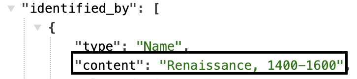
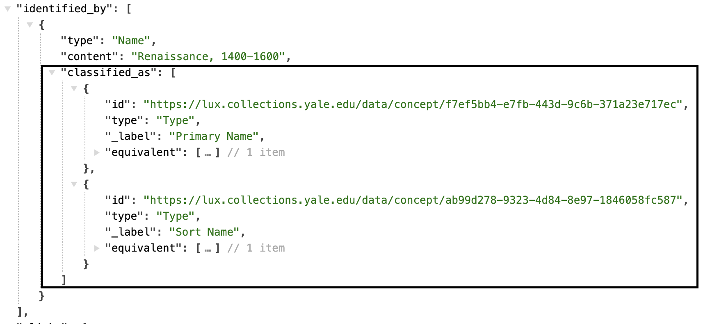
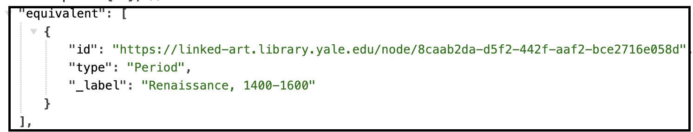
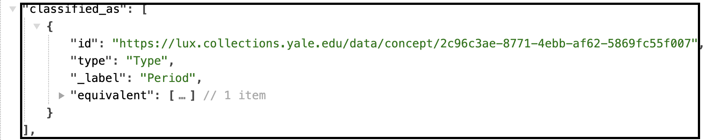
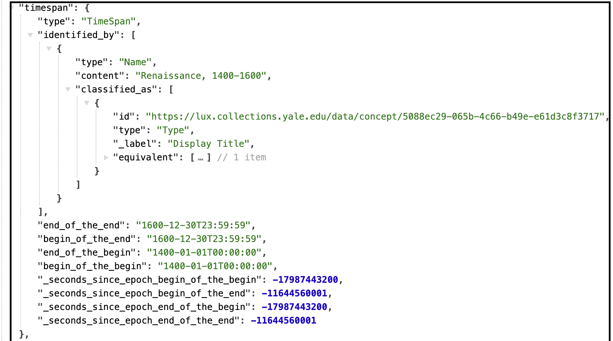

# Activity

Most of the events and activities and other temporal aspects that we care about are directly related to the objects, people, and other entities. These would include the activity that brings the entity into existence (productions, creations, births and formations), takes them out of existence (destructions, erasures, dissolutions) or otherwise significantly affects their appearance in the cultural record (when there were encountered, their publication, a person's professional activities). There are two broad classes of activity which have their own specific models -- the provenance or ownership history of the object, and exhibitions.

[Linked.art's Event Model Documentation](https://linked.art/model/event/)

### Representative Data Examples

- [Crafting Worldviews exhibition](https://lux.collections.yale.edu/data/activity/67d76666-c786-4dfd-b669-8a8081c13233)
- 
- 

 

### LUX Modeling Documentation

- [Names & Identifiers](#names-and-identifiers)
- [Classification](#classification)
- [Timespan](#timespan)
- [Statement](#statement)

### Names and Identifiers

| LUX Field Name | LUX Description | LUX Path |
| -------------- | --------------- | -------- |
| Name | Name of Period | identified_by > Name > content |

**JSON Example**

---

| LUX Field Name | LUX Description | LUX Path |
| -------------- | --------------- | -------- |
| Name Type | The classification of the name, e.g. "primary". | identified_by > Name > classified_as |

**JSON Example**

---

| LUX Field Name | LUX Description | LUX Path |
| -------------- | --------------- | -------- |
| Name Language | The language of the name, e.g. "English". | identified_by > Name > language |

**JSON Example**

---

| LUX Field Name | LUX Description | LUX Path |
| -------------- | --------------- | -------- |
| Exact Match | Holds internal URI or reconciled URI.  | equivalent |

**JSON Example**

---

| LUX Field Name | LUX Description | LUX Path |
| -------------- | --------------- | -------- |
| Internal Label | Human-readable label for Period. | _label |

**JSON Example**

### Classification

| LUX Field Name | LUX Description | LUX Path |
| -------------- | --------------- | -------- |
| Type | Classification of the Period. The LUX pipeline currently adds a classification of "Period" to all Period records, to aid in faceting in the UI. | classified_as |

**JSON Example**

### TimeSpan

| LUX Field Name | LUX Description | LUX Path |
| -------------- | --------------- | -------- |
| TimeSpan | Timespan of Period. LUX pipeline currently attempts to parse string dates into structured timespans for Periods, to aid in faceting in the UI. | timespan |

**JSON Example**

### Statement

| LUX Field Name | LUX Description | LUX Path |
| -------------- | --------------- | -------- |
| Statement | Statement about the Period. | referred_to_by > content |

**JSON Example**

---

| LUX Field Name | LUX Description | LUX Path |
| -------------- | --------------- | -------- |
| Statement Type | Classification of the statement about the Period. | referred_to_by > classified_as |

**JSON Example**
example pending

---

| LUX Field Name | LUX Description | LUX Path |
| -------------- | --------------- | -------- |
| Statement Language | Language of the statement about the Period.| referred_to_by > language |

**JSON Example**
example pending

