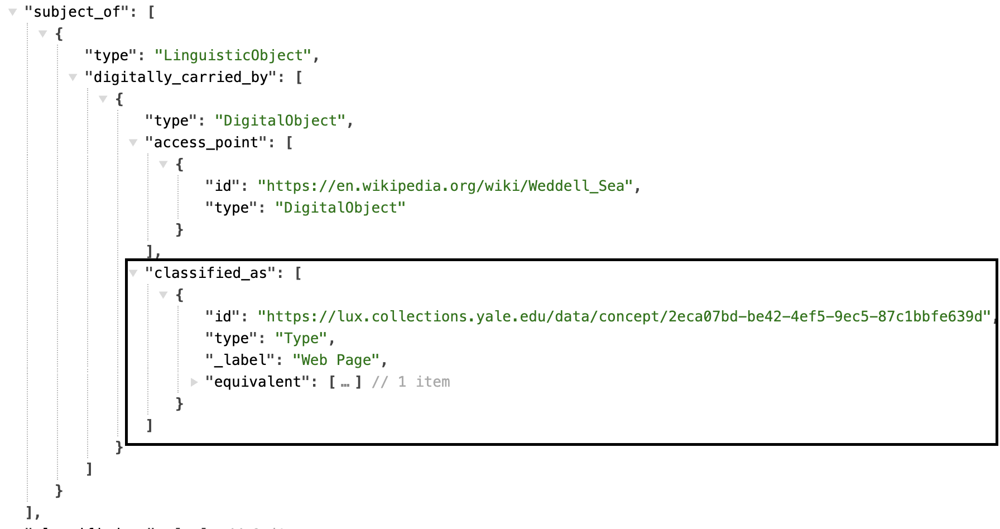

# Activity

Most of the events and activities and other temporal aspects that we care about are directly related to the objects, people, and other entities. These would include the activity that brings the entity into existence (productions, creations, births and formations), takes them out of existence (destructions, erasures, dissolutions) or otherwise significantly affects their appearance in the cultural record (when there were encountered, their publication, a person's professional activities). There are two broad classes of activity which have their own specific models -- the provenance or ownership history of the object, and exhibitions.

[Linked.art's Event Model Documentation](https://linked.art/model/event/)

### Representative Data Examples

- [Crafting Worldviews exhibition](https://lux.collections.yale.edu/data/activity/67d76666-c786-4dfd-b669-8a8081c13233)
- [Centennial Exposition](https://lux-front-tst.collections.yale.edu/data/activity/6bebc918-a857-45b4-8e47-ec48e2fdd7bc)

 

### LUX Modeling Documentation

- [Names & Identifiers](#names-and-identifiers)
- [Classification](#classification)
- [Timespan](#timespan)
- [Statement](#statement)
- [Digital Reference](#digital-reference)

### Names and Identifiers

| LUX Field Name | LUX Description | LUX Path |
| -------------- | --------------- | -------- |
| Name | Name of Activity | identified_by > Name > content |

**JSON Example**

---

| LUX Field Name | LUX Description | LUX Path |
| -------------- | --------------- | -------- |
| Name Type | The classification of the name, e.g. "primary". | identified_by > Name > classified_as |

**JSON Example**

---

| LUX Field Name | LUX Description | LUX Path |
| -------------- | --------------- | -------- |
| Name Language | The language of the name, e.g. "English". | identified_by > Name > language |

**JSON Example**

---

| LUX Field Name | LUX Description | LUX Path |
| -------------- | --------------- | -------- |
| Exact Match | On Activities, the equivalent property usually only holds the record of internal unit's URI that contributes to the LUX record. In the future as more reconciliation occurs, it will hold external URIs as well.  | equivalent |

**JSON Example**

---

| LUX Field Name | LUX Description | LUX Path |
| -------------- | --------------- | -------- |
| Internal Label | Human-readable label for Activity. | _label |

**JSON Example**

### Classification

| LUX Field Name | LUX Description | LUX Path |
| -------------- | --------------- | -------- |
| Type | Classification of the Activity. | classified_as |

**JSON Example**

### Carried Out

| LUX Field Name | LUX Description | LUX Path |
| -------------- | --------------- | -------- |
| Activity Carried Out By| Used to denote actors who carried out the Activity. | carried_out_by |

**JSON Example**

### Took Place At

| LUX Field Name | LUX Description | LUX Path |
| -------------- | --------------- | -------- |
| Location of Activity  | Used to denote the location where the Activity took place. | took_place_at |

**JSON Example**

### TimeSpan

| LUX Field Name | LUX Description | LUX Path |
| -------------- | --------------- | -------- |
| TimeSpan | Timespan of Activity.  | timespan |

**JSON Example**

### Statement

| LUX Field Name | LUX Description | LUX Path |
| -------------- | --------------- | -------- |
| Statement | Statement about the Activity. | referred_to_by > content |

**JSON Example**

---

| LUX Field Name | LUX Description | LUX Path |
| -------------- | --------------- | -------- |
| Statement Type | Classification of the statement about the Activity, e.g. "exhibition description". | referred_to_by > classified_as |

**JSON Example**
example pending

---

| LUX Field Name | LUX Description | LUX Path |
| -------------- | --------------- | -------- |
| Statement Language | Language of the statement about the Activity.| referred_to_by > language |

**JSON Example**
example pending

### Digital Reference

| LUX Field Name | LUX Description | LUX Path |
| -------------- | --------------- | -------- |
| Depicting Image | Images of Places are suppressed in the UI in favor of map tiles, but there may still be data here from Wikimedia reconciliation. | representation |

**JSON Example**
example pending

---

| LUX Field Name | LUX Description | LUX Path |
| -------------- | --------------- | -------- |
| Digital Reference | Webpages and IIIF manifests. | subject_of > digitally_carried_by |

**JSON Example**

---

| LUX Field Name | LUX Description | LUX Path |
| -------------- | --------------- | -------- |
| Digital Reference Type | Classification of digital reference. | subject_of > digitally_carried_by > classified_as |

**JSON Example**

---

| LUX Field Name | LUX Description | LUX Path |
| -------------- | --------------- | -------- |
| Name for Digital Reference | Label for the digital reference. | subject_of > digitally_carried_by > identified_by |

**JSON Example**
example pending

---

| LUX Field Name | LUX Description | LUX Path |
| -------------- | --------------- | -------- |
| Digital Reference Format | Media type of digital object (e.g. "text/html"). | subject_of > digitally_carried_by > format |

**JSON Example**
example pending

---

| LUX Field Name | LUX Description | LUX Path |
| -------------- | --------------- | -------- |
| Digital Reference Access Point | The ID field in this array is used to store the website URL, for example, "https://nyc.gov". | subject_of > digitally_carried_by > access_point |

**JSON Example**

