# Digital Object

It is very unlikely that the descriptions provided in the Linked Art model are the only digital representations of the entities that they describe. There are also digital images, web pages, and other related content that should be referenced from the descriptions of the entities. The digital object may be also be the entity of interest, such as an eBook, net art, or a digital installation with its own separate record. 

Digital objects are generally treated in the same way as physical objects -- they are carriers of information, not the information itself.

[Linked.art's Digital Object Model Documentation](https://linked.art/model/digital/)

### Representative Data Examples

- [Divided We Govern](https://lux.collections.yale.edu/data/digital/600b2f09-ad30-4423-b7b4-575fd24ff26c)
- [Interview with Martina Droth, 2016-10-14](https://lux.collections.yale.edu/data/digital/600b2f09-ad30-4423-b7b4-575fd24ff26c)
- [The flight of Apollo 11 : Eagle has landed](https://lux.collections.yale.edu/data/digital/105ae1fe-caf4-47ac-9049-867b13d8d923)

### LUX Modeling Documentation

- [Names & Identifiers](#names-and-identifiers)
- [Classification](#classification)
- [Creation](#creation) 
- [Statement](#statement)
- [Part Of](#part-of)
- [Referenced Works](#referenced-works)
- [Digital Reference](#digital-reference)

### Names and Identifiers

| LUX Field Name | LUX Description | LUX Path |
| -------------- | --------------- | -------- |
| Name | The name for the Digital Object. This field is often synonymous with title. | identified_by > Name > content |

**JSON Example**
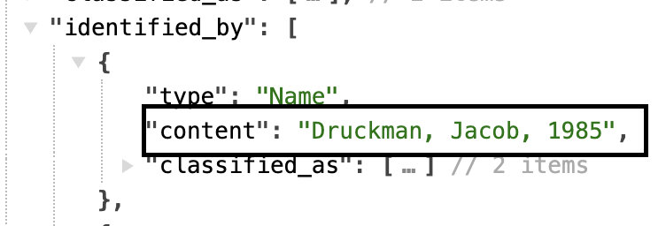

---

| LUX Field Name | LUX Description | LUX Path |
| -------------- | --------------- | -------- |
| Name Type | The classification of the name, e.g. "primary" or "sort". | identified_by > Name > classified_as |

**JSON Example**
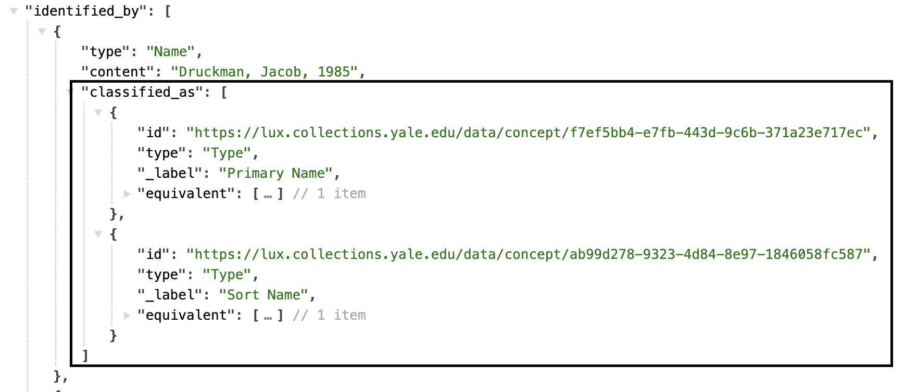

---

| LUX Field Name | LUX Description | LUX Path |
| -------------- | --------------- | -------- |
| Name Language | The language of the name, e.g. "English". | identified_by > Name > language |

**JSON Example**
example pending

---

| LUX Field Name | LUX Description | LUX Path |
| -------------- | --------------- | -------- |
| Identifier  | Numerical identifiers for Digital Object. | identified_by > Identifier > content |

**JSON Example**
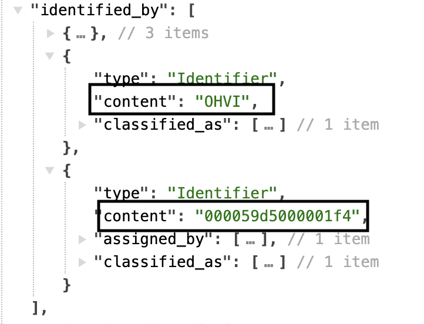

---

| LUX Field Name | LUX Description | LUX Path |
| -------------- | --------------- | -------- |
| Identifier Type | Classification of identifier for Digital Object, e.g. "call number". | identified_by > Identifier > classified_as   |

**JSON Example**
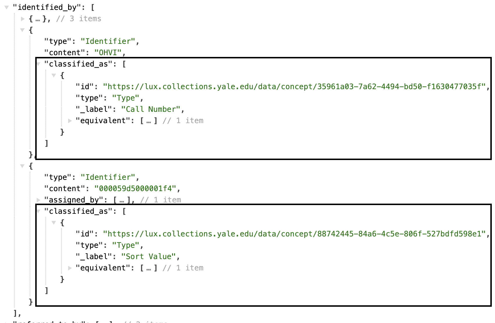

---

| LUX Field Name | LUX Description | LUX Path |
| -------------- | --------------- | -------- |
| Identifier Data Assignment | Used to denote the assigner of the identifier. For archives, this is accompanied by motivated_by to assign Digital Objects to their archival sets.  | identified_by > Identifier > assigned_by > AttributeAssignment |

**JSON Example**
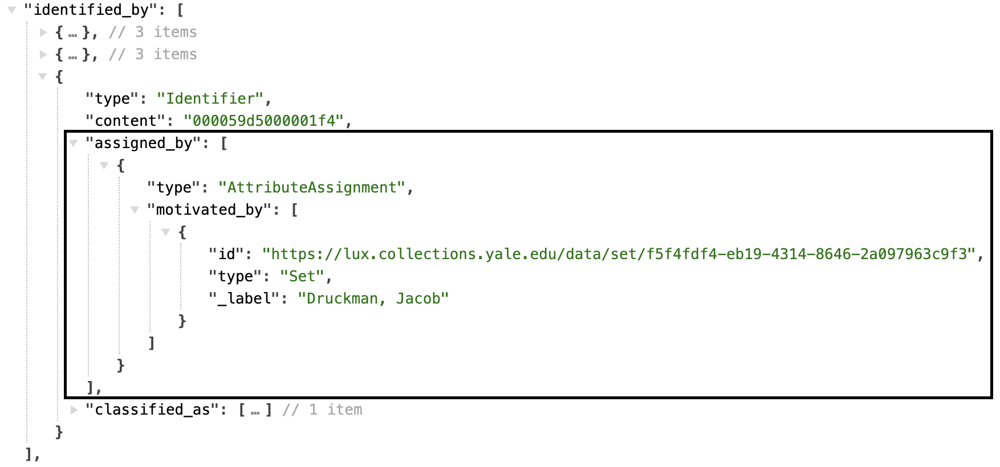

---

| LUX Field Name | LUX Description | LUX Path |
| -------------- | --------------- | -------- |
| Exact Match | On Digital Objects, the equivalent property usually only holds the record of internal unit's URI that contributes to the LUX record.  | equivalent |

**JSON Example**
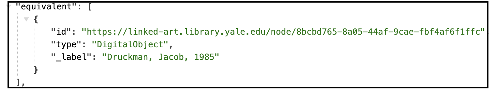

---

| LUX Field Name | LUX Description | LUX Path |
| -------------- | --------------- | -------- |
| Internal Label | Human-readable label for Digital Object. | _label |

**JSON Example**
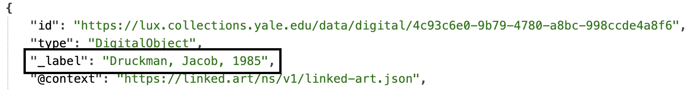

### Classification

| LUX Field Name | LUX Description | LUX Path |
| -------------- | --------------- | -------- |
| Type | Classification of the Human Made Object, e.g. "archival material". | classified_as |

**JSON Example**
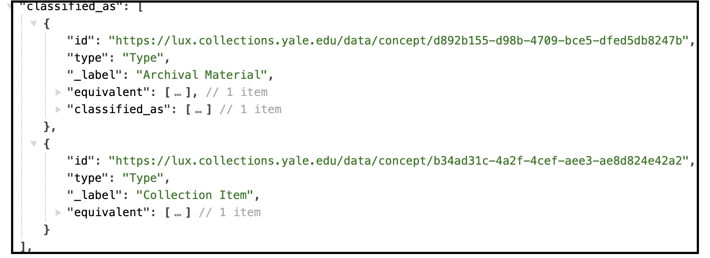

### Creation

| LUX Field Name | LUX Description | LUX Path |
| -------------- | --------------- | -------- |
| Creator in Production Event | Creator of the Digital Object. Could be nested in `part`. | created_by > carried_out_by |

**JSON Example**
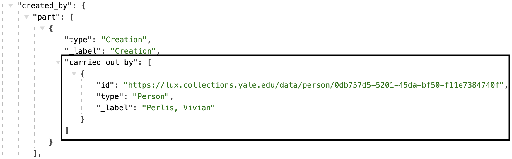

---

| LUX Field Name | LUX Description | LUX Path |
| -------------- | --------------- | -------- |
| Location of Creation Event | Location of creation. | created_by > took_place_at |

**JSON Example**
example pending

---

| LUX Field Name | LUX Description | LUX Path |
| -------------- | --------------- | -------- |
| Creation Event Type | Classification of the creation. | created_by > classified_as |

**JSON Example**
example pending

---

| LUX Field Name | LUX Description | LUX Path |
| -------------- | --------------- | -------- |
| TimeSpan of Creation Event | Timespan of creation. | created_by > timespan |

**JSON Example**
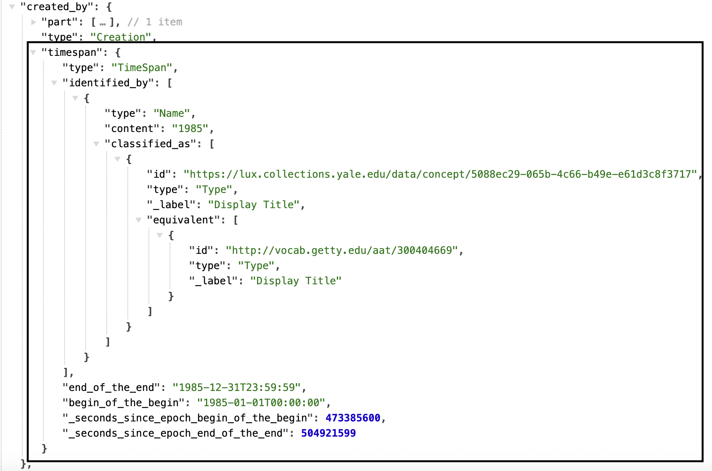

---

| LUX Field Name | LUX Description | LUX Path |
| -------------- | --------------- | -------- |
| Statement about Creation Event | Statements about the Creation. | created_by > referred_to_by |

**JSON Example**
example pending

### Statement

| LUX Field Name | LUX Description | LUX Path |
| -------------- | --------------- | -------- |
| Statement | Statement about the Digital Object, e.g. "physical description". | referred_to_by > content |

**JSON Example**
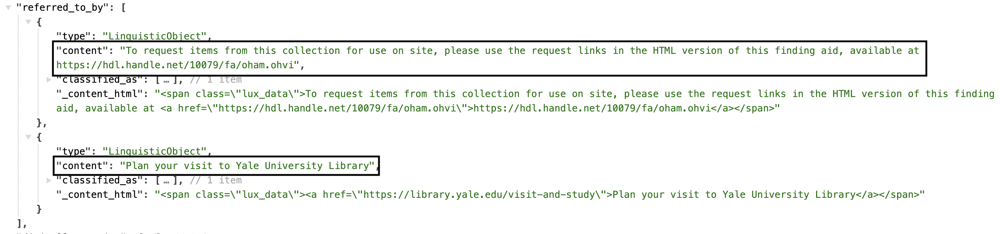

---

| LUX Field Name | LUX Description | LUX Path |
| -------------- | --------------- | -------- |
| Statement Type | Classification of the statement.| referred_to_by > classified_as |

**JSON Example**
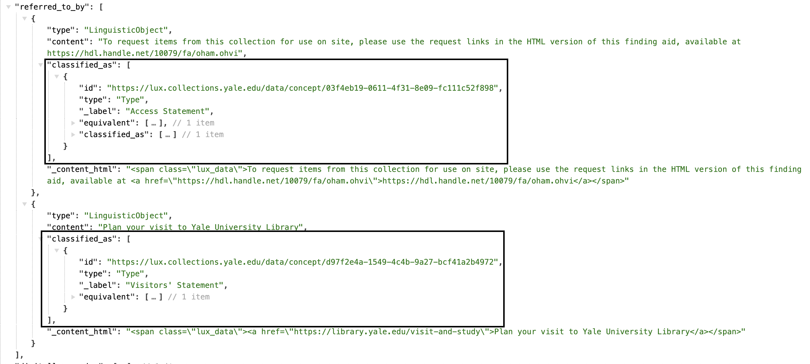

---

| LUX Field Name | LUX Description | LUX Path |
| -------------- | --------------- | -------- |
| Statement Language | Language of statement. | referred_to_by > language |

**JSON Example**
example pending

---

| LUX Field Name | LUX Description | LUX Path |
| -------------- | --------------- | -------- |
| Name for Statement | In LUX, units can leverage this field to push a specific label for statements on a Work. For example, if the classification label is not your preferred label, you can use a string label in the content of the statement name and the front end will display this as the statement label. | referred_to_by > identified_by |

**JSON Example**
example pending

### Part Of

| LUX Field Name | LUX Description | LUX Path |
| -------------- | --------------- | -------- |
| Part of Digital Resource | Used to link Digital Object to other Digital Objects it is a part of. | part_of |

**JSON Example**
example pending

---

| LUX Field Name | LUX Description | LUX Path |
| -------------- | --------------- | -------- |
| Part of Set | Set this Digital Object is a member of. | member_of |

**JSON Example**
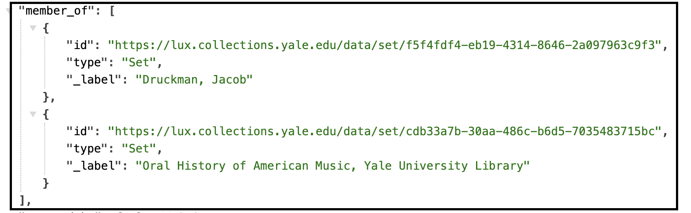

### Referenced Works

| LUX Field Name | LUX Description | LUX Path |
| -------------- | --------------- | -------- |
| Visual Image Shown | Visual item the Digital Object shows. | digitally_shows |

**JSON Example**
example pending

---

| LUX Field Name | LUX Description | LUX Path |
| -------------- | --------------- | -------- |
| Text Carried | Textual Work the Digital Object carries. | digitally_carries |

**JSON Example**
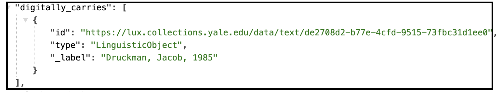

### Digital References

| LUX Field Name | LUX Description | LUX Path |
| -------------- | --------------- | -------- |
| Digital Reference | Webpages and IIIF manifests. | subject_of > digitally_carried_by |

**JSON Example**
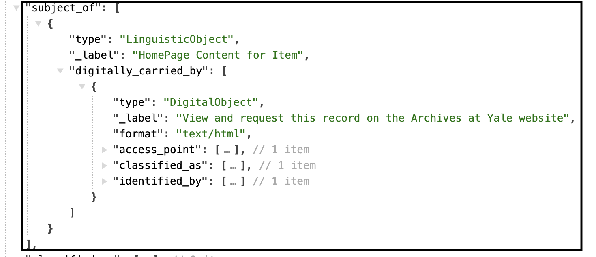

---

| LUX Field Name | LUX Description | LUX Path |
| -------------- | --------------- | -------- |
| Digital Reference Type | Classification of digital reference. | subject_of > digitally_carried_by > classified_as |

**JSON Example**
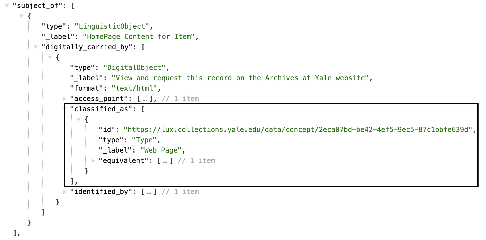

---

| LUX Field Name | LUX Description | LUX Path |
| -------------- | --------------- | -------- |
| Name for Digital Reference | Label for the digital reference. | subject_of > digitally_carried_by > identified_by |

**JSON Example**
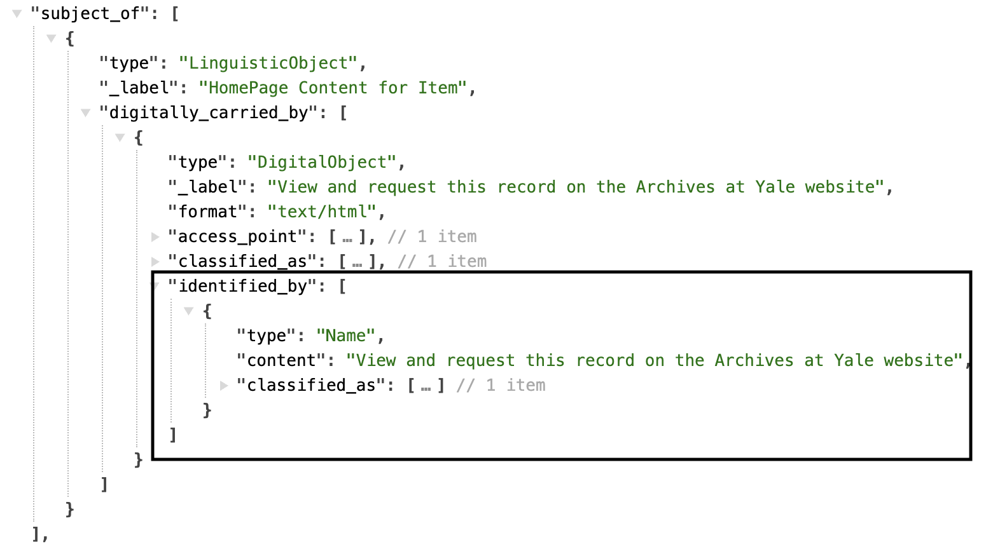

---

| LUX Field Name | LUX Description | LUX Path |
| -------------- | --------------- | -------- |
| Digital Reference Format | Media type of digital object (e.g. "text/html"). | subject_of > digitally_carried_by > format |

**JSON Example**
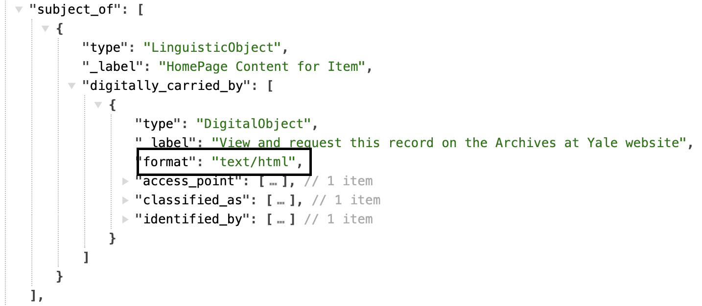

---

| LUX Field Name | LUX Description | LUX Path |
| -------------- | --------------- | -------- |
| Digital Reference Access Point | Website URL or URI of digital object. | subject_of > digitally_carried_by > access_point |

**JSON Example**
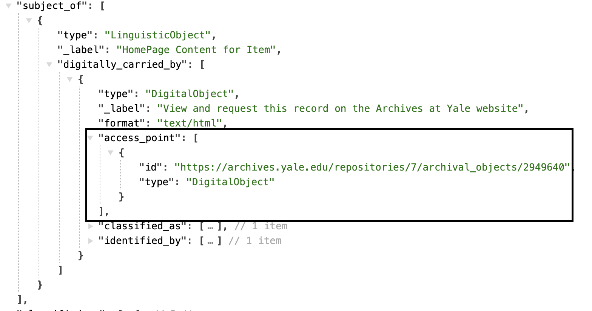

