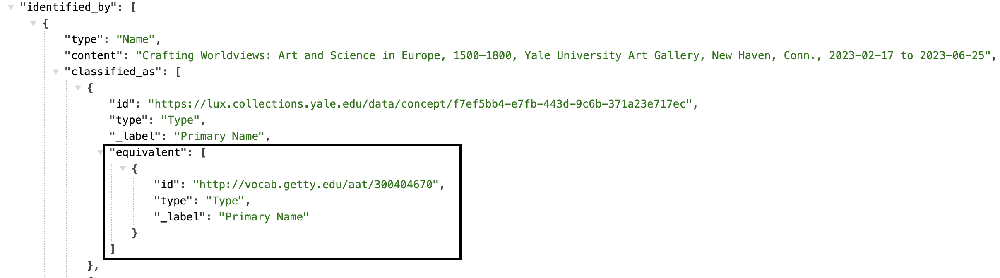
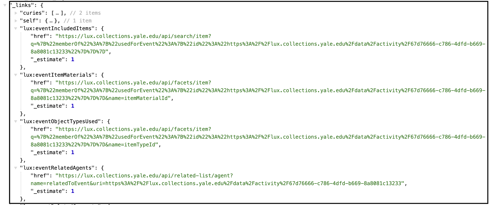
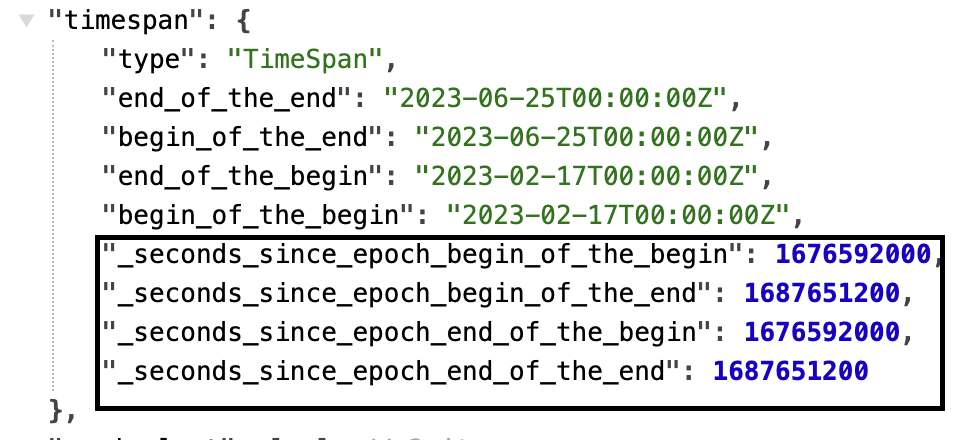
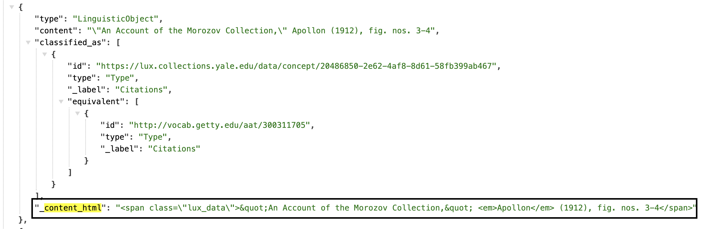

# LUX Supplementary Fields

There are several fields apparent in the data view of LUX records that do not exist in the Linked.art model or are specific to LUX's use of Linked.art and apply across several fields.

Documentation on these appear below.

### Supplementary Fields

- [AAT Equivalents](#aat-equivalents)
- [HAL Links](#hal-links)
- [Timespan Epoch Seconds](#timespan-epoch-seconds)
- [Content HTML](#content-html)

### AAT Equivalents
The pipeline programmatically injects the AAT equivalent for many classifications to serve as a data constant for the middle tier and front end. You may find these nested equivalents anywhere `classified_as` appears, and it will be in the `equivalent` property of the classification. 

**JSON Example**

### HAL Links
For requests for a full document (i.e., no profile specified), LUX's Middle Tier appends a set of HAL [Hypertext Application Language](https://en.wikipedia.org/wiki/Hypertext_Application_Language) links to make it easier for users/clients to identify the query needed to get data that are related to the entity.

Read more and see all available HAL links in the [Middle Tier documentation](https://github.com/project-lux/lux-middletier/blob/baab3a3b87ac4af91356cd9e7f9f8feeb785bc1a/docs/hal-links.md#L4).

These appear in the data under the `_links` property, at the bottom of the JSON. 

**JSON Example**

### Timespan Epoch Seconds
Anywhere a timespan appears (associated with an activity of some kind), the LUX pipeline code creates and appends `_seconds_since_epoch` fields. This is for faceting of dates.

See the code in the mapper that performs this task [here](https://github.com/project-lux/data-pipeline/blob/dd05a930c3603fc2f613a4b9e69c387d4985dc39/pipeline/sources/lux/marklogic/mapper.py#L137-147).

**JSON Example**

### Content HTML
LUX pipeline scans the content of statements for html, and if found, cleans the html from the content and moves the html content into a field called `_content_html`. This is because the front end does not handle html directly embedded in the data.

See the code in the mapper that performs this task [here](https://github.com/project-lux/data-pipeline/blob/dd05a930c3603fc2f613a4b9e69c387d4985dc39/pipeline/sources/lux/marklogic/mapper.py#L82-96).

**JSON Example**

