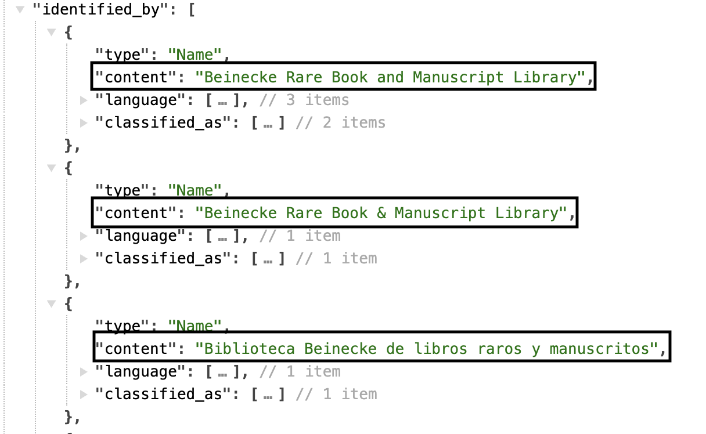
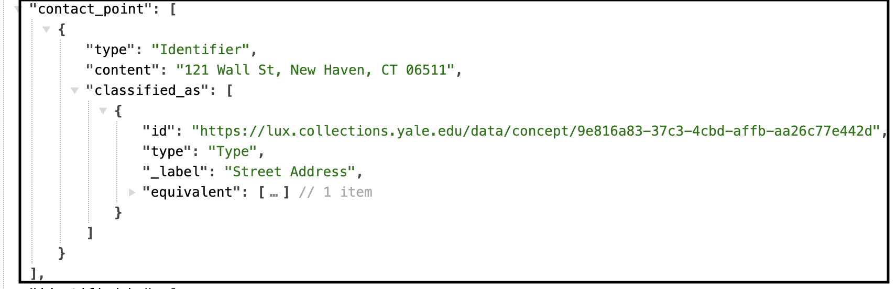
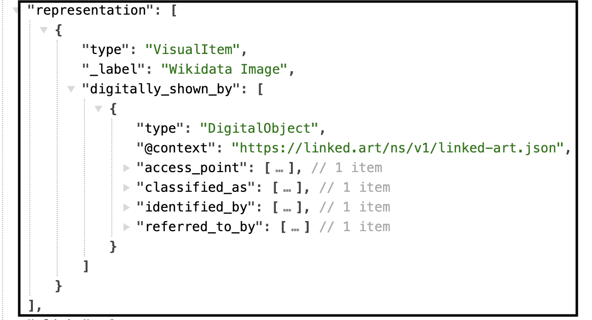
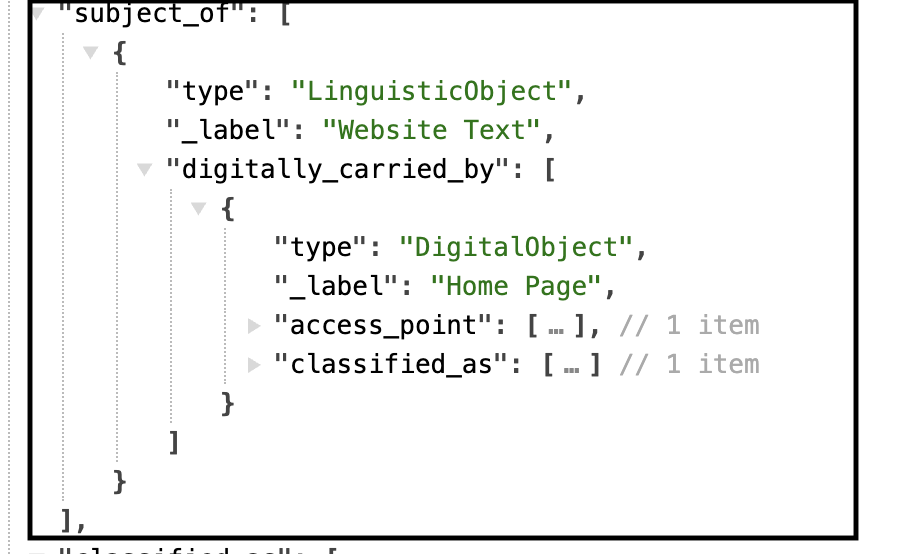

# Group

All activities are carried out by some actor, either a person (Person) or a group of people (Group) such as an organization or company. The identity and description of these actors are very important to record in order to provide the human context for the activities, and their related places and objects. The creators, finders, owners, sellers and curators of objects are all relevant to understanding our cultural heritage.

[Linked.art's Group Model Documentation](https://linked.art/model/actor/)

- [Names & Identifiers](#names-and-identifiers)
- [Classification](#classification)
- [Contact Point](#contact-point)
- [Residence](#residence)
- [Formation](#formation)
- [Dissolution](#dissolution)
- [Professional Activity](#professional-activity)
- [Statement](#statement)
- [Member Of](#member-of)

### Names and Identifiers

| LUX Field Name | LUX Description | LUX Path |
| -------------- | --------------- | -------- |
| Name | Name of Group | identified_by > Name > content |

**JSON Example**

---

| LUX Field Name | LUX Description | LUX Path |
| -------------- | --------------- | -------- |
| Name Type | The classification of the name, e.g. "primary". | identified_by > Name > classified_as |

**JSON Example**

---

| LUX Field Name | LUX Description | LUX Path |
| -------------- | --------------- | -------- |
| Name Language | The language of the name, e.g. "English". | identified_by > Name > language |

**JSON Example**

---

| LUX Field Name | LUX Description | LUX Path |
| -------------- | --------------- | -------- |
| Exact Match | Holds internal URI or reconciled URI.  | equivalent |

**JSON Example**

---

| LUX Field Name | LUX Description | LUX Path |
| -------------- | --------------- | -------- |
| Internal Label | Human-readable label for Group. | _label |

**JSON Example**

### Classification

| LUX Field Name | LUX Description | LUX Path |
| -------------- | --------------- | -------- |
| Type | Classification of the Group, e.g. "corporation". | classified_as |

**JSON Example**

---

| LUX Field Name | LUX Description | LUX Path |
| -------------- | --------------- | -------- |
| Nationality | A type of classification of the Group, but specifically to record the Group's nationality. | classified_as >  |

**JSON Example**

---

| LUX Field Name | LUX Description | LUX Path |
| -------------- | --------------- | -------- |
| Occupation | A type of classification of the Group, but specifically to record the Group's occupation or role. | classified_as >  |

**JSON Example**

### Contact Point

| LUX Field Name | LUX Description | LUX Path |
| -------------- | --------------- | -------- |
| Contact Point | If a source provides us with an address or email for the Group, it will be recorded here.  | contact_point |

**JSON Example**

---

| LUX Field Name | LUX Description | LUX Path |
| -------------- | --------------- | -------- |
| Contact Point Classification | Classification of contact point, e.g. "email". | contact_point > classified_as |

**JSON Example**

### Residence

| LUX Field Name | LUX Description | LUX Path |
| -------------- | --------------- | -------- |
| Residence | Location of Group. | residence|

**JSON Example**

### Formation

| LUX Field Name | LUX Description | LUX Path |
| -------------- | --------------- | -------- |
| Formation Actor | Person or Persons who formed the Group. | formed_by > carried_out_by|

**JSON Example**

---

| LUX Field Name | LUX Description | LUX Path |
| -------------- | --------------- | -------- |
| Formation Location | Location where Group was formed. | formed_by > took_place_at|

**JSON Example**

---

| LUX Field Name | LUX Description | LUX Path |
| -------------- | --------------- | -------- |
| Formation Timespan | Timespan for formation of Group. | formed_by > timespan|

**JSON Example**

### Dissolution

| LUX Field Name | LUX Description | LUX Path |
| -------------- | --------------- | -------- |
| Dissolution Location | Location where Group was dissolved. | dissolved_by > took_place_at|

**JSON Example**

---

| LUX Field Name | LUX Description | LUX Path |
| -------------- | --------------- | -------- |
| Dissolution Timespan | Timespan for dissolution of Group. | dissolved_by > timespan|

**JSON Example**

### Professional Activity

| LUX Field Name | LUX Description | LUX Path |
| -------------- | --------------- | -------- |
| Professional Activity Location | Location where Group was professionally active. | carried_out > took_place_at|

**JSON Example**

---

| LUX Field Name | LUX Description | LUX Path |
| -------------- | --------------- | -------- |
| Professional Activity Timespan | Timespan for professional activity of Group. | carried_out > timespan|

**JSON Example**

### Statement

| LUX Field Name | LUX Description | LUX Path |
| -------------- | --------------- | -------- |
| Statement | Biographical or other statements about the Group. | referred_to_by > content |

**JSON Example**

---

| LUX Field Name | LUX Description | LUX Path |
| -------------- | --------------- | -------- |
| Statement Type | Classification of the statement about the Group, e.g. "biographical". | referred_to_by > classified_as |

**JSON Example**

---

| LUX Field Name | LUX Description | LUX Path |
| -------------- | --------------- | -------- |
| Statement Language | Language of the statement about the Group, e.g. "english". | referred_to_by > language |

**JSON Example**

### Member Of

| LUX Field Name | LUX Description | LUX Path |
| -------------- | --------------- | -------- |
| Member Of | Used to denote membership of this Group to a specified Group. | member_of |

**JSON Example**

### Digital Images

| LUX Field Name | LUX Description | LUX Path |
| -------------- | --------------- | -------- |
| Depicting Image | Used to store data for images. Images for People come from Wikimedia. | representation |

**JSON Example**

---

| LUX Field Name | LUX Description | LUX Path |
| -------------- | --------------- | -------- |
| Digital Reference | Webpages and IIIF manifests. | subject_of > digitally_carried_by |

**JSON Example**

---

| LUX Field Name | LUX Description | LUX Path |
| -------------- | --------------- | -------- |
| Digital Reference Type | Classification of digital reference. | subject_of > digitally_carried_by > classified_as |

**JSON Example**

---

| LUX Field Name | LUX Description | LUX Path |
| -------------- | --------------- | -------- |
| Name for Digital Reference | Label for the digital reference. | subject_of > digitally_carried_by > identified_by |

**JSON Example**
does not exist in current data

---

| LUX Field Name | LUX Description | LUX Path |
| -------------- | --------------- | -------- |
| Digital Reference Format | Media type of digital object (e.g. "text/html"). | subject_of > digitally_carried_by > format |

**JSON Example**
does not exist in current data

---

| LUX Field Name | LUX Description | LUX Path |
| -------------- | --------------- | -------- |
| Digital Reference Access Point | Website URL or URI of digital object. | subject_of > digitally_carried_by > access_point |

**JSON Example**

