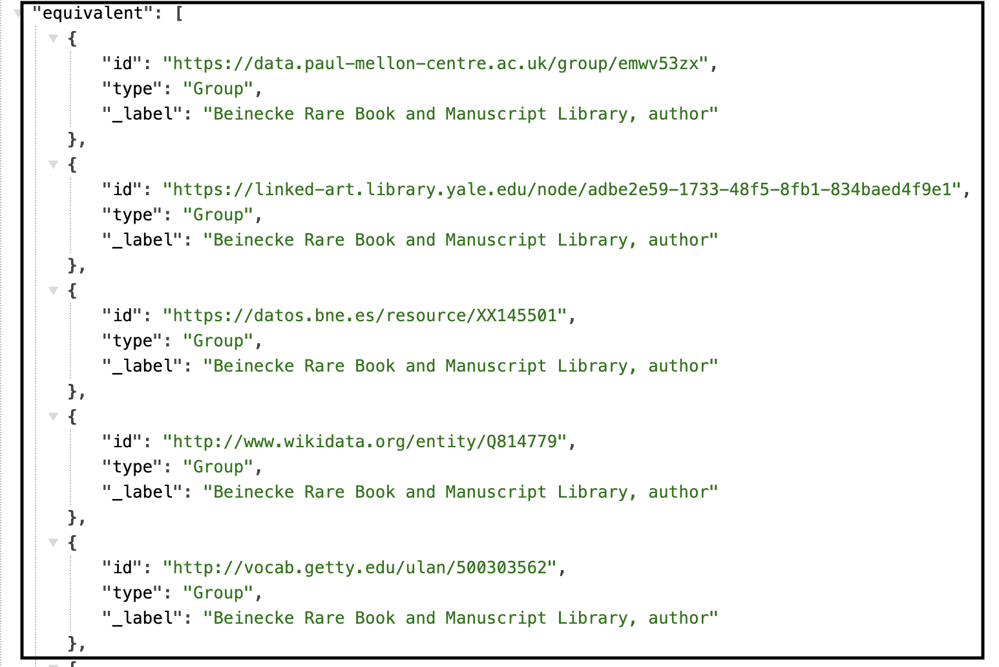
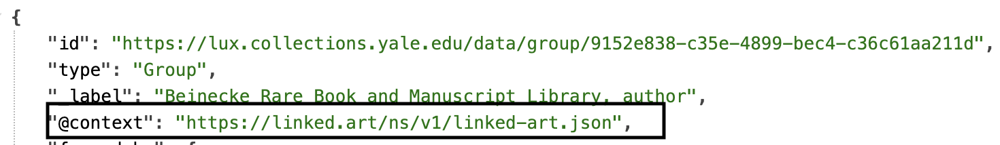
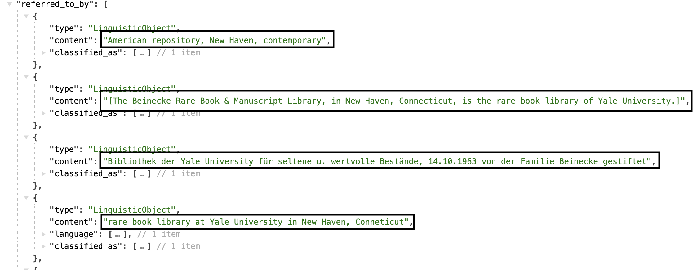

# Group

All activities are carried out by some actor, either a person (Person) or a group of people (Group) such as an organization or company. The identity and description of these actors are very important to record in order to provide the human context for the activities, and their related places and objects. The creators, finders, owners, sellers and curators of objects are all relevant to understanding our cultural heritage.

[Linked.art's Group Model Documentation](https://linked.art/model/actor/)

- [Names & Identifiers](#names-and-identifiers)
- [Classification](#classification)
- [Contact Point](#contact-point)
- [Statement](#statement)
- [Member Of](#member-of)

### Names and Identifiers

| LUX Field Name | LUX Description | LUX Path |
| -------------- | --------------- | -------- |
| Name | Name of Group | identified_by > Name > content |

**JSON Example**

---

| LUX Field Name | LUX Description | LUX Path |
| -------------- | --------------- | -------- |
| Name Type | The classification of the name, e.g. "primary". | identified_by > Name > classified_as |

**JSON Example**

---

| LUX Field Name | LUX Description | LUX Path |
| -------------- | --------------- | -------- |
| Name Language | The language of the name, e.g. "English". | identified_by > Name > language |

**JSON Example**

---

| LUX Field Name | LUX Description | LUX Path |
| -------------- | --------------- | -------- |
| Exact Match | Holds internal URI or reconciled URI.  | equivalent |

**JSON Example**

---

| LUX Field Name | LUX Description | LUX Path |
| -------------- | --------------- | -------- |
| Internal Label | Human-readable label for Group. | _label |

**JSON Example**

### Classification

| LUX Field Name | LUX Description | LUX Path |
| -------------- | --------------- | -------- |
| Type | Classification of the Group, e.g. "corporation". | classified_as |

**JSON Example**

---

| LUX Field Name | LUX Description | LUX Path |
| -------------- | --------------- | -------- |
| Nationality | A type of classification of the Group, but specifically to record the Group's nationality. | classified_as >  |

**JSON Example**

---

| LUX Field Name | LUX Description | LUX Path |
| -------------- | --------------- | -------- |
| Occupation | A type of classification of the Group, but specifically to record the Group's occupation or role. | classified_as >  |

**JSON Example**

### Contact Point

| LUX Field Name | LUX Description | LUX Path |
| -------------- | --------------- | -------- |
| Contact Point | If a source provides us with an address or email for the Group, it will be recorded here.  | contact_point |

**JSON Example**

---

| LUX Field Name | LUX Description | LUX Path |
| -------------- | --------------- | -------- |
| Contact Point Classification | Classification of contact point, e.g. "email". | contact_point > classified_as |

**JSON Example**

### Statement

| LUX Field Name | LUX Description | LUX Path |
| -------------- | --------------- | -------- |
| Statement | Biographical or other statements about the Group. | referred_to_by > content |

**JSON Example**

---

| LUX Field Name | LUX Description | LUX Path |
| -------------- | --------------- | -------- |
| Statement Type | Classification of the statement about the Group, e.g. "biographical". | referred_to_by > classified_as |

**JSON Example**

---

| LUX Field Name | LUX Description | LUX Path |
| -------------- | --------------- | -------- |
| Statement Language | Language of the statement about the Group, e.g. "english". | referred_to_by > language |

**JSON Example**

---

| LUX Field Name | LUX Description | LUX Path |
| -------------- | --------------- | -------- |
| Name for Statement | Label override for statements in UI. | referred_to_by > identified_by |

**JSON Example**

### Member Of

| LUX Field Name | LUX Description | LUX Path |
| -------------- | --------------- | -------- |
| Member Of | Used to denote membership of this Group to a specified Group. | member_of |

**JSON Example**

