# Human Made Object

The class for physical objects that have some value in human society is HumanMadeObject. Even if the object is a shell (and thus natural) without any significant modifications, this class is still used as the modification is the instilling of value by society. 

[Linked.art's HMO Model Documentation](https://linked.art/model/object/)

- [Names & Identifiers](#names-and-identifiers)
- [Classification](#classification)
- [Physicality](#physicality)
- [Production](#production)
- [Encounter](#encounter)
- [Statement](#statement)
- [Part Of](#part-of)
- [Referenced Works](#referenced-works)
- [Digital Images](#digital-images)
- [Current Status](#current-status)

### Names and Identifiers

| LUX Field Name | LUX Description | LUX Path |
| -------------- | --------------- | -------- |
| Name | The name for the Human Made Object. This field is often synonymous with title. | identified_by > Name > content |

**JSON Example**
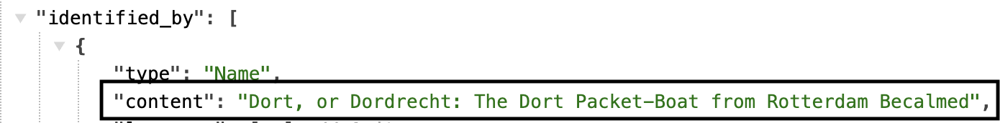

---

| LUX Field Name | LUX Description | LUX Path |
| -------------- | --------------- | -------- |
| Name Type | The classification of the name, e.g. "primary" or "sort". | identified_by > Name > classified_as |

**JSON Example**
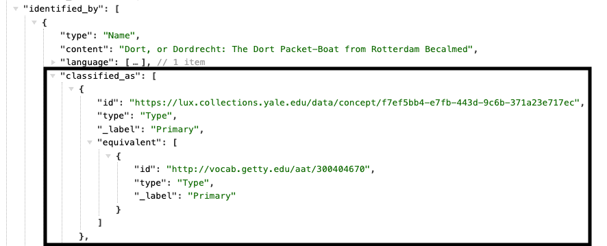

---

| LUX Field Name | LUX Description | LUX Path |
| -------------- | --------------- | -------- |
| Name Language | The language of the name, e.g. "English". | identified_by > Name > language |

**JSON Example**

---

| LUX Field Name | LUX Description | LUX Path |
| -------------- | --------------- | -------- |
| Identifier  | Numerical identifiers for Human Made Object. | identified_by > Identifier > content |

**JSON Example**
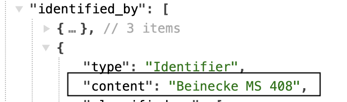

---

| LUX Field Name | LUX Description | LUX Path |
| -------------- | --------------- | -------- |
| Identifier Type | Classification of identifiers. | identified_by > Identifier > classified_as   |

**JSON Example**
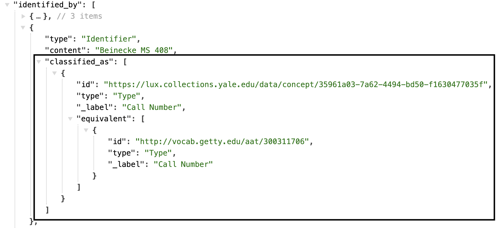

---

| LUX Field Name | LUX Description | LUX Path |
| -------------- | --------------- | -------- |
| Identifier Data Assignment | Used to denote the assigner of the identifier.  | identified_by > Identifier > assigned_by > AttributeAssignment |

**JSON Example**
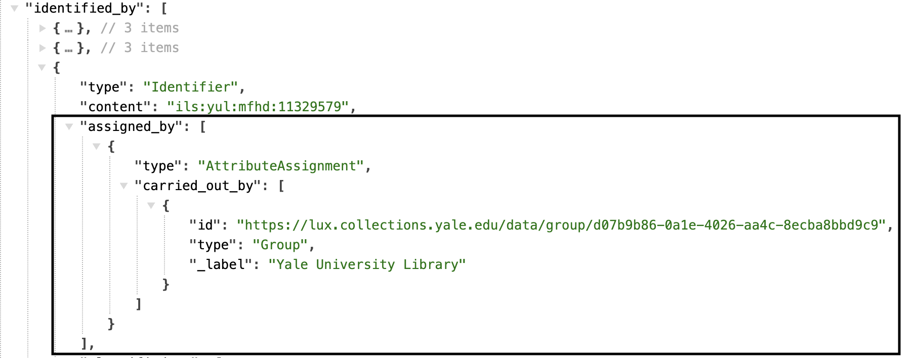

---

| LUX Field Name | LUX Description | LUX Path |
| -------------- | --------------- | -------- |
| Exact Match | Holds internal URI or reconciled Wikidata URI.  | equivalent |

**JSON Example**
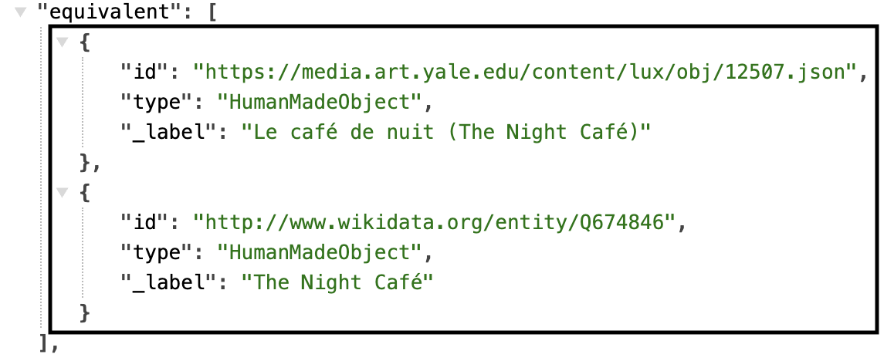

---

| LUX Field Name | LUX Description | LUX Path |
| -------------- | --------------- | -------- |
| Internal Label | Human-readable label for object. | _label |

**JSON Example**
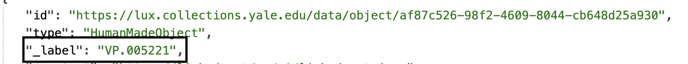

### Classification

| LUX Field Name | LUX Description | LUX Path |
| -------------- | --------------- | -------- |
| Type | Classification of the Human Made Object, e.g. "painting" or "fossil". | classified_as |

**JSON Example**
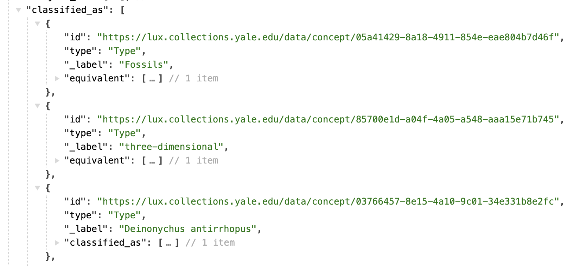

### Physicality

| LUX Field Name | LUX Description | LUX Path |
| -------------- | --------------- | -------- |
| Dimension Value | Numerical value of the dimension. | dimension > value |

**JSON Example**
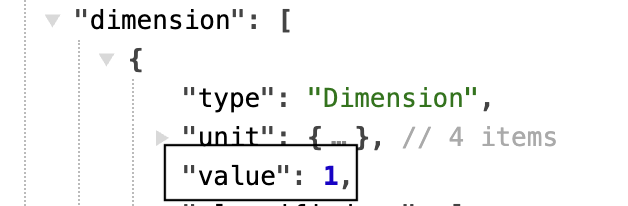

---

| LUX Field Name | LUX Description | LUX Path |
| -------------- | --------------- | -------- |
| Dimension Unit | Unit for the dimension, e.g. centimeters. | dimension > unit |

**JSON Example**
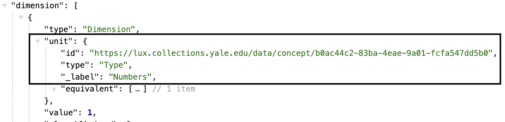

---

| LUX Field Name | LUX Description | LUX Path |
| -------------- | --------------- | -------- |
| Dimension Type | Classification for the dimension, e.g. height. | dimension > classified_as |

**JSON Example**
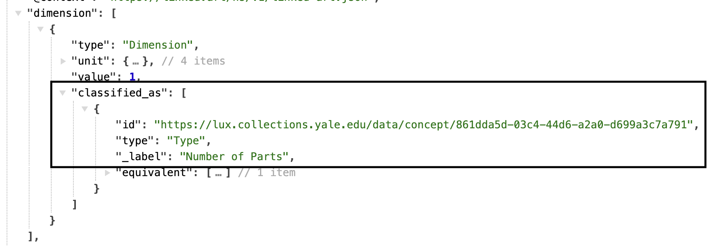

---

| LUX Field Name | LUX Description | LUX Path |
| -------------- | --------------- | -------- |
| Material | Material of the object. | made_of |

**JSON Example**
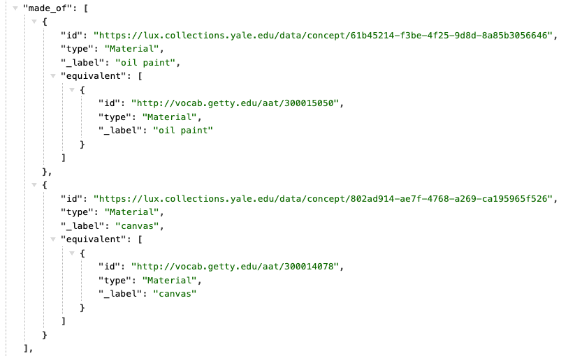

### Production

| LUX Field Name | LUX Description | LUX Path |
| -------------- | --------------- | -------- |
| Creator in Production Event | Producer of the object, e.g. artist, maker. | produced_by > carried_out_by |

**JSON Example**
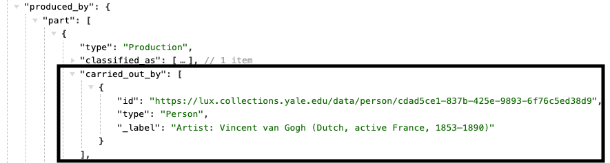

---

| LUX Field Name | LUX Description | LUX Path |
| -------------- | --------------- | -------- |
| Location of Production Event | Location of production. | produced_by > took_place_at |

**JSON Example**
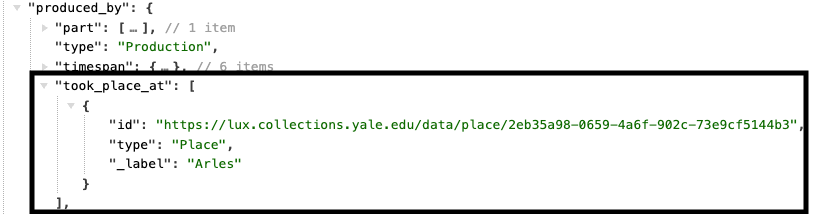

---

| LUX Field Name | LUX Description | LUX Path |
| -------------- | --------------- | -------- |
| Production Event Technique | Technique of production. | produced_by > technique |

**JSON Example**
example pending
---

| LUX Field Name | LUX Description | LUX Path |
| -------------- | --------------- | -------- |
| Influence on Production Event | Entity influencing the production. | produced_by > influenced_by |

**JSON Example**
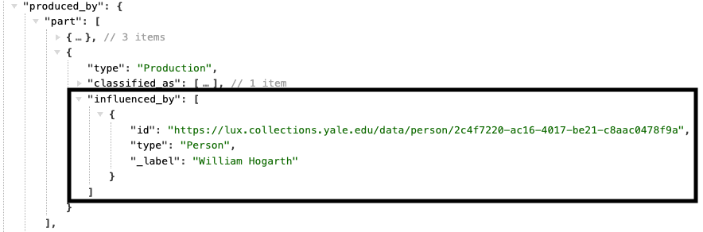

---

| LUX Field Name | LUX Description | LUX Path |
| -------------- | --------------- | -------- |
| Production Event Type | Classification of the production. | produced_by > classified_as |

**JSON Example**
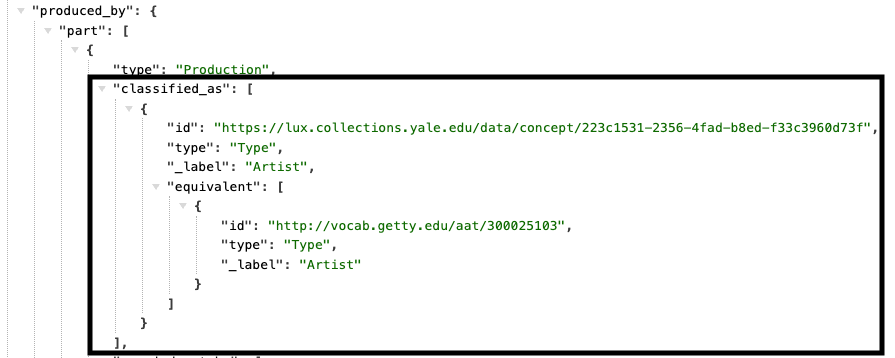

---

| LUX Field Name | LUX Description | LUX Path |
| -------------- | --------------- | -------- |
| Production Event Part | Break production into parts. | produced_by > part |

**JSON Example**
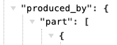

---

| LUX Field Name | LUX Description | LUX Path |
| -------------- | --------------- | -------- |
| TimeSpan of Production Event | Timespan of production. | produced_by > timespan |

**JSON Example**
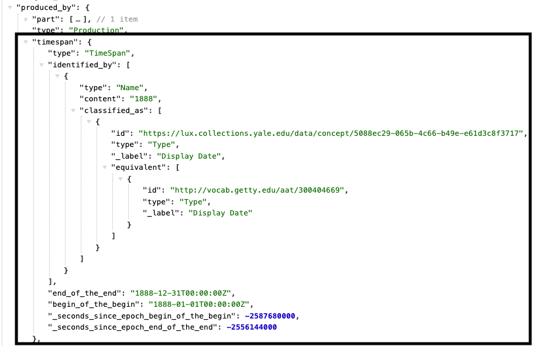

---

| LUX Field Name | LUX Description | LUX Path |
| -------------- | --------------- | -------- |
| Statement about Production Event | Statements about the Production. | produced_by > referred_to_by |

**JSON Example**

### Encounter

| LUX Field Name | LUX Description | LUX Path |
| -------------- | --------------- | -------- |
| Agent in Encounter Event | Person or Group who encountered the object. | encountered_by > carried_out_by |

**JSON Example**
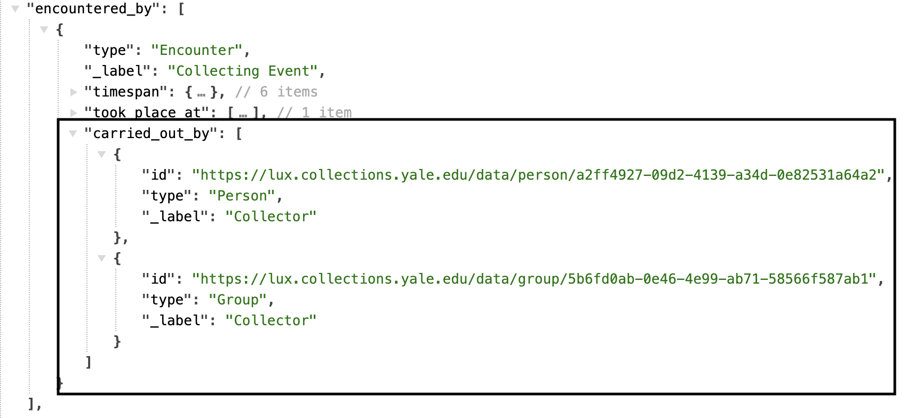

---

| LUX Field Name | LUX Description | LUX Path |
| -------------- | --------------- | -------- |
| Location of Encounter Event | Location of encounter. | encountered_by > took_place_at |

**JSON Example**
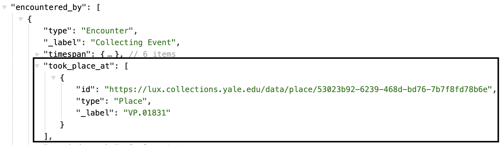

---

| LUX Field Name | LUX Description | LUX Path |
| -------------- | --------------- | -------- |
| Encounter Event Type | Classification of encounter. | encountered_by > classified_as |

**JSON Example**
example pending

---

| LUX Field Name | LUX Description | LUX Path |
| -------------- | --------------- | -------- |
| TimeSpan of Encounter Event | Timespan of encounter. | encountered_by > timespan |

**JSON Example**
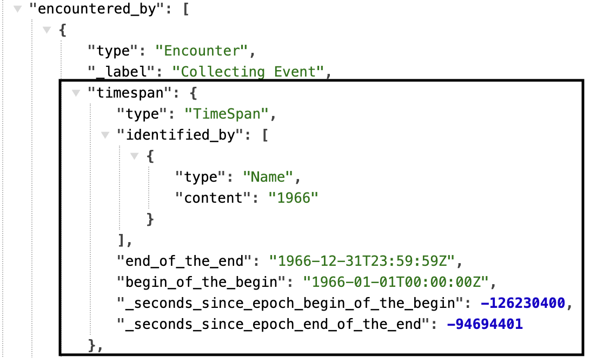

---

| LUX Field Name | LUX Description | LUX Path |
| -------------- | --------------- | -------- |
| Statement about Encounter Event | Statements about the Encounter. | encountered_by > referred_to_by |

**JSON Example**
example pending

### Statement

| LUX Field Name | LUX Description | LUX Path |
| -------------- | --------------- | -------- |
| Statement | Statements about the Human Made Object. | referred_to_by > content |

**JSON Example**
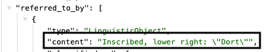

---

| LUX Field Name | LUX Description | LUX Path |
| -------------- | --------------- | -------- |
| Statement Type | Classification of the statement about the Human Made Object, e.g. "provenance statement". | referred_to_by > classified_as |

**JSON Example**
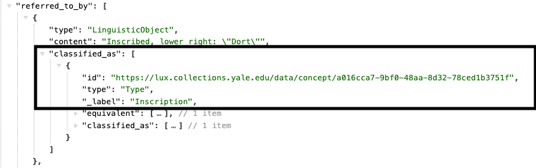

---

| LUX Field Name | LUX Description | LUX Path |
| -------------- | --------------- | -------- |
| Statement Type Metatype | Note classification metatype. | referred_to_by > classified_as > classified_as |

**JSON Example**
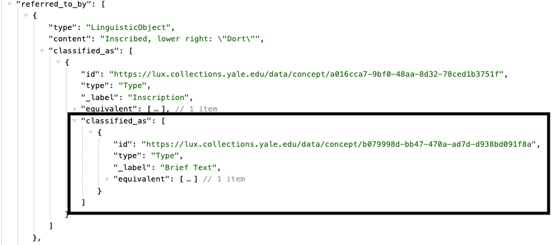

---

| LUX Field Name | LUX Description | LUX Path |
| -------------- | --------------- | -------- |
| Statement Language | Language of statement. | referred_to_by > language |

**JSON Example**
example pending

---

| LUX Field Name | LUX Description | LUX Path |
| -------------- | --------------- | -------- |
| Name for Statement | Label override for statements in UI. | referred_to_by > identified_by |

**JSON Example**
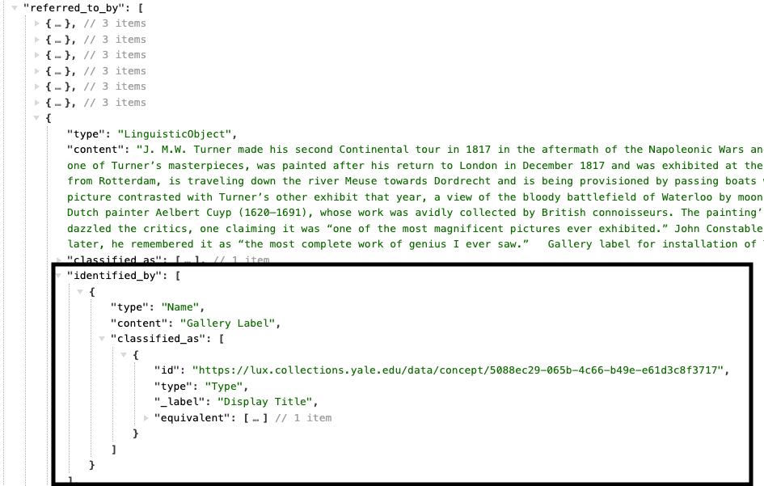

### Part Of

| LUX Field Name | LUX Description | LUX Path |
| -------------- | --------------- | -------- |
| Part of Object | Another, possibly larger object, that this object forms part of. | part_of |

**JSON Example**
example pending

---

| LUX Field Name | LUX Description | LUX Path |
| -------------- | --------------- | -------- |
| Part of Set | Set this object is a member of. | member_of |

**JSON Example**
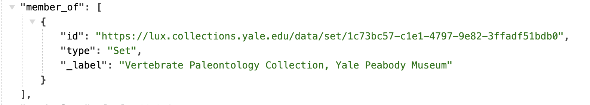

### Referenced Works

| LUX Field Name | LUX Description | LUX Path |
| -------------- | --------------- | -------- |
| Visual Image Shown | Visual item the object shows. Objects from the Peabody will not have this property. | shows |

**JSON Example**
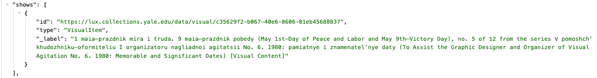

---

| LUX Field Name | LUX Description | LUX Path |
| -------------- | --------------- | -------- |
| Text Carried | Textual Work the object carries. Objects from the Peabody will not have this property. | carries |

**JSON Example**

### Digital Images

| LUX Field Name | LUX Description | LUX Path |
| -------------- | --------------- | -------- |
| Depicting Image | Thumbnail representation of the image. | representation |

**JSON Example**
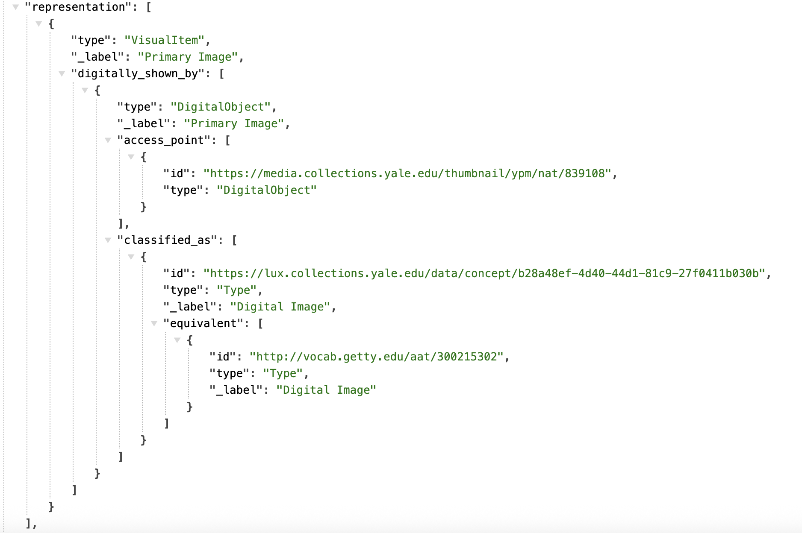

---

| LUX Field Name | LUX Description | LUX Path |
| -------------- | --------------- | -------- |
| Digital Reference | Webpages and IIIF manifests. | subject_of > digitally_carried_by |

**JSON Example**

---

| LUX Field Name | LUX Description | LUX Path |
| -------------- | --------------- | -------- |
| Digital Reference Type | Classification of digital reference. | subject_of > digitally_carried_by > classified_as |

**JSON Example**
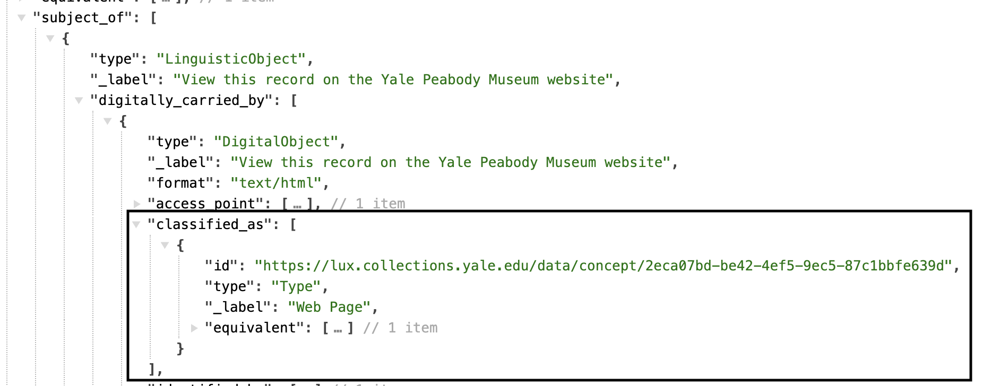

---

| LUX Field Name | LUX Description | LUX Path |
| -------------- | --------------- | -------- |
| Name for Digital Reference | Label for the digital reference. | subject_of > digitally_carried_by > identified_by |

**JSON Example**
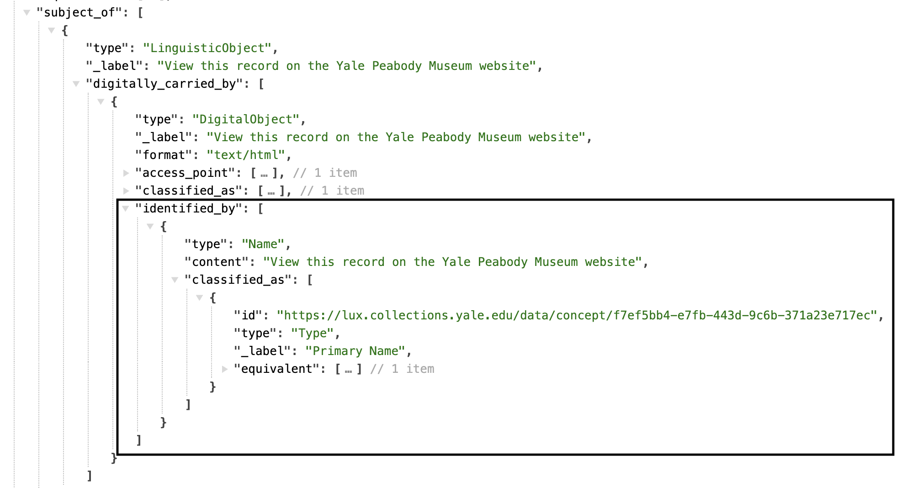

---

| LUX Field Name | LUX Description | LUX Path |
| -------------- | --------------- | -------- |
| Digital Reference Format | Media type of digital object (e.g. "text/html"). | subject_of > digitally_carried_by > format |

**JSON Example**
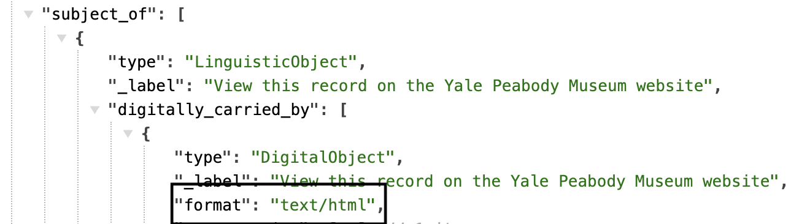

---

| LUX Field Name | LUX Description | LUX Path |
| -------------- | --------------- | -------- |
| Digital Reference Access Point | Website URL or URI of digital object. | subject_of > digitally_carried_by > access_point |

**JSON Example**

### Current Status

| LUX Field Name | LUX Description | LUX Path |
| -------------- | --------------- | -------- |
| Current Location | Current physical location. | current_location |

**JSON Example**
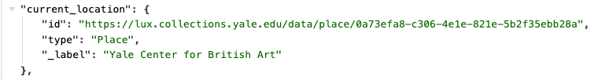

---

| LUX Field Name | LUX Description | LUX Path |
| -------------- | --------------- | -------- |
| Current Owner | Current owner of the object. | current_owner |

**JSON Example**
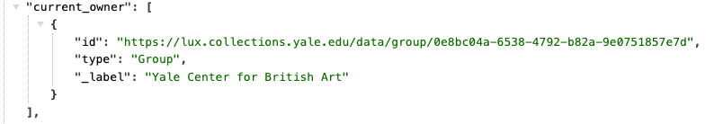
