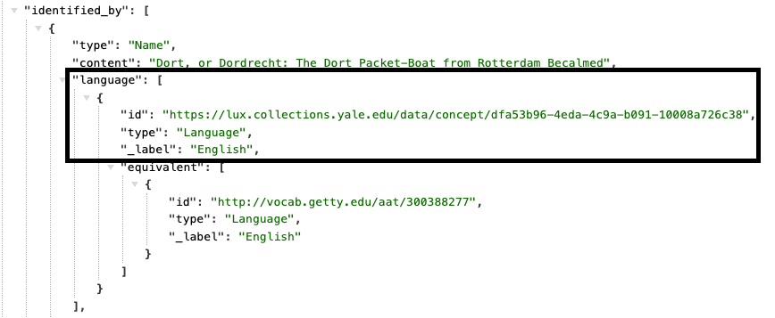
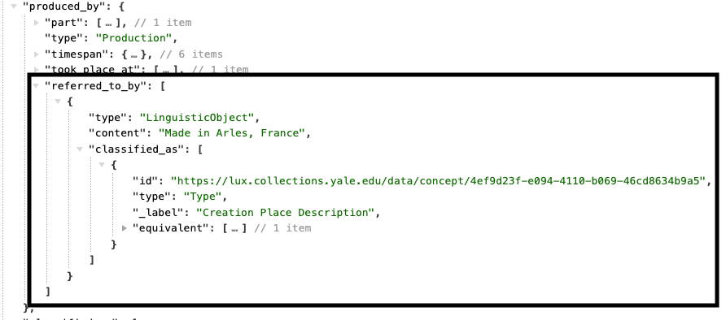

# Human Made Object

The class for physical objects that have some value in human society is HumanMadeObject. Even if the object is a shell (and thus natural) without any significant modifications, this class is still used as the modification is the instilling of value by society. 

[Linked.art's HMO Model Documentation](https://linked.art/model/object/)

## Table of Contents

- [Names & Identifiers](#names-and-identifiers)
- [Classification](#classification)
- [Physicality](#physicality)
- [Production](#production)
- [Encounter](#encounter)
- [Statement](#statement)
- [Part Of](#part-of)
- [Referenced Works](#referenced-works)
- [Digital Images](#digital-images)
- [Current Status](#current-status)

### Names and Identifiers

| LUX Field Name | LUX Description | LUX Path |
| -------------- | --------------- | -------- |
| Name | The name for the Human Made Object. This field is often synonymous with title. | identified_by > Name > content |

| Name Type  | The classification of the name, e.g. "primary" or "sort".  | identified\_by > Name > classified\_as  | 

 

| Name Language | The language of the name, e.g. "English".  | identified\_by > Name > language |  
   

| Identifier  | Numerical identifiers for Human Made Object.  | identified\_by > Identifier > content  | 
   

| Identifier Type   | Classification of identifiers.   | identified\_ by > Identifier > classified\_as  |   
    

| Identifier Data Assignment       | Used to denote the assigner of the identifier, e.g. Yale Center for British Art assigned their accession number. | identified\_by > Identifier > assigned\_by > AttributeAssignment |  
   

| Exact Match   | On Human Made Objects, the equivalent property usually holds the record of internal unit's URI that contributes to the LUX record. It may also include a Wikidata URI, if this Object was reconciled to Wikidata.   | equivalent   |   
  

| Internal Label    | Human-readable label for object.   | \_label  |  
  

### Classification

| LUX Field Name | LUX Description | LUX Path |
| -------------- | --------------- | -------- |
| Type                             | Classification of the Human Made Object, e.g. "painting" or "fossil".                                            | classified\_as              |  
 

### Physicality

| LUX Field Name | LUX Description | LUX Path |
| -------------- | --------------- | -------- |
| Dimension Value                  | Numerical value of the dimension.                                                                                | dimension > value                                                | 
  

| Dimension Unit                   | Unit for the dimension, e.g. centimeters.                                                                        | dimension > unit                                                 | 
 

| Dimension Type                   | Classification for the dimension, e.g. height.                                                                   | dimension > classified\_as                                       | 
 

| Material                         | Material of the object.                                                                                          | made\_of                                                         |  
  

### Production

| LUX Field Name | LUX Description | LUX Path |
| -------------- | --------------- | -------- |
| Creator in Production Event      | Producer of the object, e.g. artist, maker.                                                                      | produced\_by > carried\_out\_by                                  |  

| Location of Production Event     | Location of production.                                                                                          | produced\_by > took\_place\_at                                   |  

| Production Event Technique       | Technique of production.                                                                                         | produced\_by > technique        | 

| Influence on Production Event    | Entity influencing the production.                                                                               | produced\_by > influenced\_by                                    |   
 

| Production Event Type            | Classification of the production.                                                                                | produced\_by > classified\_as                                    |   

| Production Event Part            | Break production into parts.                                                                                     | produced\_by > part                                              |  
 

| TimeSpan of Production Event     | Timespan of production.                                                                                          | produced\_by > timespan     | 

| Statement about Production Event | Statements about the Production.                                                                                 | produced\_by > referred\_to\_by                                  | 
  

### Encounter

| LUX Field Name | LUX Description | LUX Path |
| -------------- | --------------- | -------- |
| Agent in Encounter Event       | Person or Group who encountered the object.                                                                      | encountered\_by > carried\_out\_by                               |  

| Location of Encounter Event      | Location of encounter.                                                                                           | encountered\_by > took\_place\_at                                |  

| Encounter Event Type             | Classification of encounter.                                                                                     | encountered\_by > classified\_as                                 | 

| TimeSpan of Encounter Event      | Timespan of encounter.                                                                                           | encountered\_by > timespan                                       |  
 

| Statement about Encounter Event  | Statements about the Encounter.                                                                                  | encountered\_by > referred\_to\_by                               |  

### Statement

| LUX Field Name | LUX Description | LUX Path |
| -------------- | --------------- | -------- |
| Statement                        | Statements about the Human Made Object.                                                                          | referred\_to\_by > content                                       | 

| Statement Type                   | Classification of the statement about the Human Made Object, e.g. "provenance statement".                        | referred\_to\_by > classified\_as                                |  
 

| Statement Type Metatype          | Note classification metatype.                                                                                    | referred\_to\_by > classified\_as > classified\_as               |   
  

| Statement Language               | Language of statement.                                                                                           | referred\_to\_by > language                                      |   

| Name for Statement               | Label override for statements in UI.                                                                             | referred\_to\_by > identified\_by                                |  

### Part Of

| LUX Field Name | LUX Description | LUX Path |
| -------------- | --------------- | -------- |
| Part of Object                   | Another, possibly larger object, that this object forms part of.                                                                      | part\_of                                                         |  

| Part of Set                      | Set this object is a member of.                                                                                  | member\_of                                                       | 

### Referenced Works

| LUX Field Name | LUX Description | LUX Path |
| -------------- | --------------- | -------- |
| Visual Image Shown               | Visual item the object shows. Objects from the Peabody will not have this property.                                                                                 | shows                                                            | 
 

| Text Carried                     | Textual Work the object carries. Objects from the Peabody will not have this property.                                                                                | carries                                                          |  
 

### Digital Images

| LUX Field Name | LUX Description | LUX Path |
| -------------- | --------------- | -------- |
| Depicting Image                  | Thumbnail representation of the image.                                                                           | representation                                                   |   
 

| Digital Reference                | Webpages and IIIF manifests.                                                                                     | subject\_of > digitally\_carried\_by                             |  

| Digital Reference Type           | Classification of digital reference.                                                                             | subject\_of > digitally\_carried\_by > classified\_as            |  
 

| Name for Digital Reference       | Label for the digital reference.                                                                                 | subject\_of > digitally\_carried\_by > identified\_by            |  

| Digital Reference Format         | Media type of digital object (e.g. "text/html").                                                                 | subject\_of > digitally\_carried\_by > format                    |  
 

| Digital Reference Access Point   | Website URL or URI of digital object.                                                                            | subject\_of > digitally\_carried\_by > access\_point             | 
  

### Current Status

| LUX Field Name | LUX Description | LUX Path |
| -------------- | --------------- | -------- |
| Current Location                 | Current physical location.                                                                                       | current\_location                                                | 
 

| Current Owner                    | Current owner of the object.                                                                                     | current\_owner                                                   |  
 

