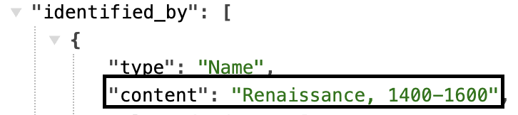
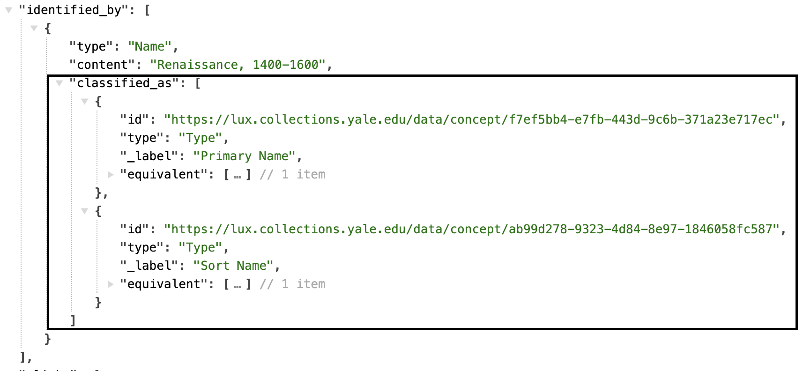
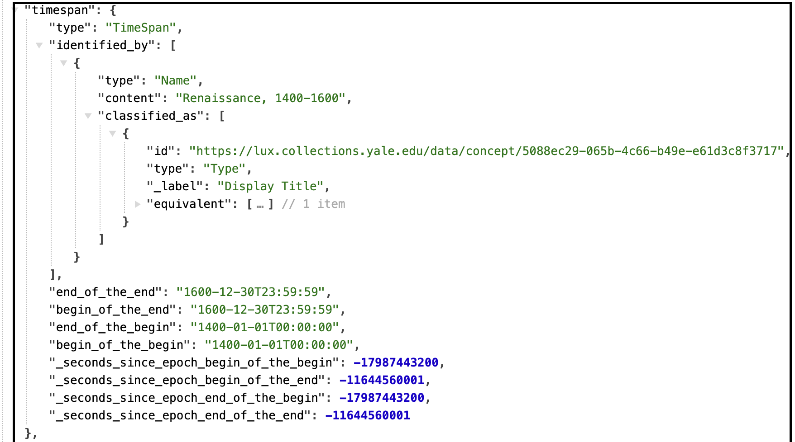

# Period

Periods are a sub-Class of Events. They are defined as a period of time, likely somewhat arbitrarily defined, such as an "age" or century. 

[Linked.art's Event Model Documentation](https://linked.art/model/event/)

### Representative Data Examples

- [Renaissance, 1400-1600](https://lux.collections.yale.edu/data/activity/539ba4f0-15bf-480e-aa96-66cd4a40531e)
- [Holocene](https://lux.collections.yale.edu/data/activity/3d302672-6037-45c3-8bcb-23ed200e7721)
- [Ming-Qing dynasties, 1368-1912](https://lux.collections.yale.edu/data/activity/e43535d2-4315-497f-9132-b5160b72356e)

 

### LUX Modeling Documentation

- [Names & Identifiers](#names-and-identifiers)
- [Classification](#classification)
- [Timespan](#timespan)
- [Statement](#statement)

### Names and Identifiers

| LUX Field Name | LUX Description | LUX Path |
| -------------- | --------------- | -------- |
| Name | Name of Period | identified_by > Name > content |

**JSON Example**

---

| LUX Field Name | LUX Description | LUX Path |
| -------------- | --------------- | -------- |
| Name Type | The classification of the name, e.g. "primary". | identified_by > Name > classified_as |

**JSON Example**

---

| LUX Field Name | LUX Description | LUX Path |
| -------------- | --------------- | -------- |
| Name Language | The language of the name, e.g. "English". | identified_by > Name > language |

**JSON Example**

---

| LUX Field Name | LUX Description | LUX Path |
| -------------- | --------------- | -------- |
| Exact Match | Holds internal URI or reconciled URI.  | equivalent |

**JSON Example**

---

| LUX Field Name | LUX Description | LUX Path |
| -------------- | --------------- | -------- |
| Internal Label | Human-readable label for Period. | _label |

**JSON Example**

### Classification

| LUX Field Name | LUX Description | LUX Path |
| -------------- | --------------- | -------- |
| Type | Classification of the Period. The LUX pipeline currently adds a classification of "Period" to all Period records, to aid in faceting in the UI. | classified_as |

**JSON Example**

### TimeSpan

| LUX Field Name | LUX Description | LUX Path |
| -------------- | --------------- | -------- |
| TimeSpan | Timespan of Period. LUX pipeline currently attempts to parse string dates into structured timespans for Periods, to aid in faceting in the UI. | timespan |

**JSON Example**

### Statement

| LUX Field Name | LUX Description | LUX Path |
| -------------- | --------------- | -------- |
| Statement | Statement about the Period. | referred_to_by > content |

**JSON Example**

---

| LUX Field Name | LUX Description | LUX Path |
| -------------- | --------------- | -------- |
| Statement Type | Classification of the statement about the Period. | referred_to_by > classified_as |

**JSON Example**
example pending

---

| LUX Field Name | LUX Description | LUX Path |
| -------------- | --------------- | -------- |
| Statement Language | Language of the statement about the Period.| referred_to_by > language |

**JSON Example**
example pending

