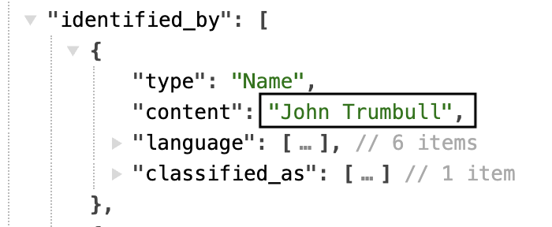
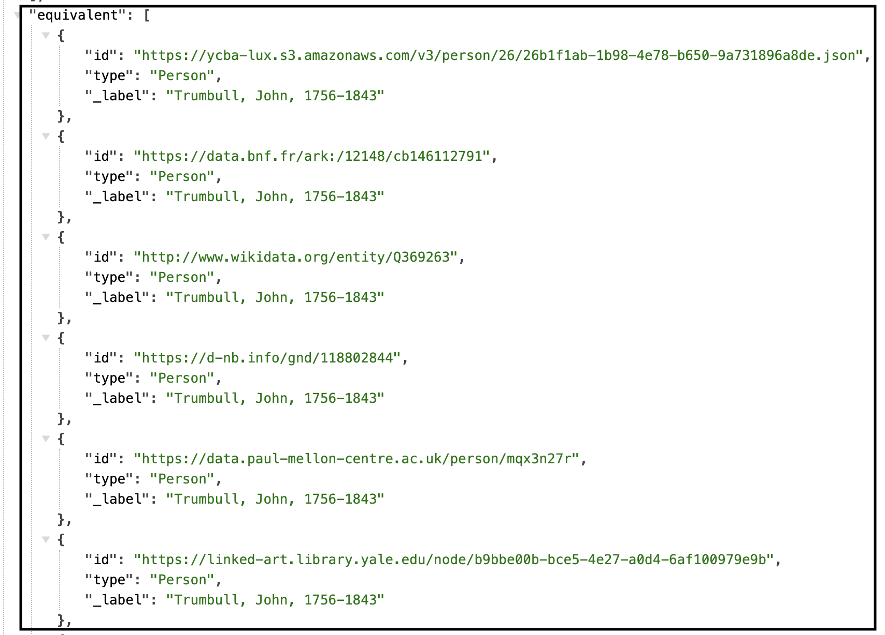
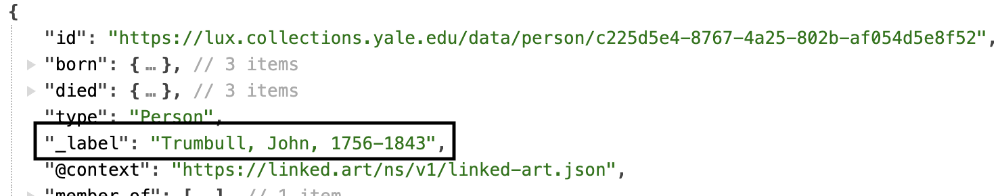
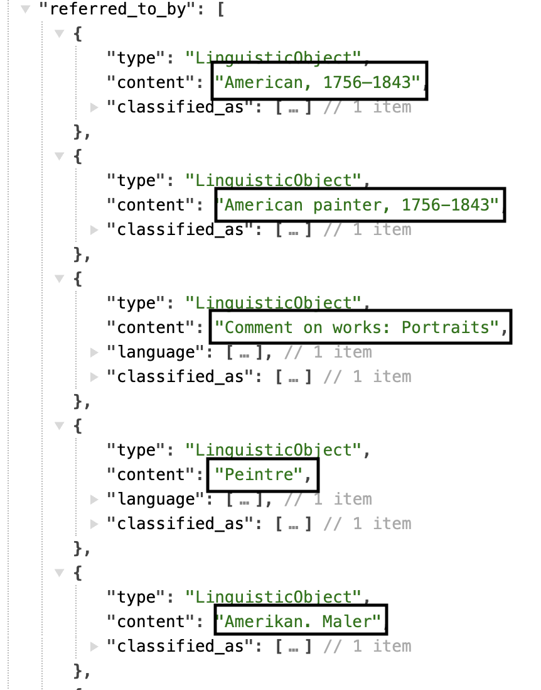
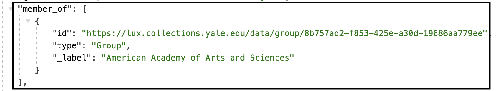
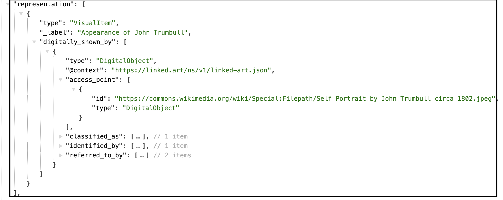

# Person

All activities are carried out by some actor, either a person (Person) or a group of people (Group) such as an organization or company. The identity and description of these actors are very important to record in order to provide the human context for the activities, and their related places and objects. The creators, finders, owners, sellers and curators of objects are all relevant to understanding our cultural heritage.

[Linked.art's Person Model Documentation](https://linked.art/model/actor/)

- [Names & Identifiers](#names-and-identifiers)
- [Classification](#classification)
- [Contact Point](#contact-point)
- [Birth](#birth)
- [Death](#death)
- [Professional Activity](#professional-activity)
- [Statement](#statement)
- [Member Of](#member-of)

### Names and Identifiers

| LUX Field Name | LUX Description | LUX Path |
| -------------- | --------------- | -------- |
| Name | Name of Person | identified_by > Name > content |

**JSON Example**

---

| LUX Field Name | LUX Description | LUX Path |
| -------------- | --------------- | -------- |
| Name Type | The classification of the name, e.g. "primary". | identified_by > Name > classified_as |

**JSON Example**

---

| LUX Field Name | LUX Description | LUX Path |
| -------------- | --------------- | -------- |
| Name Language | The language of the name, e.g. "English". | identified_by > Name > language |

**JSON Example**

---

| LUX Field Name | LUX Description | LUX Path |
| -------------- | --------------- | -------- |
| Name Part | Currently, YPM is the only LUX data source to contribute name parts. This is each piece of the name submitted in separate fields with specific classifications, e.g. "first", "last". | identified_by > part |

**JSON Example**

---

| LUX Field Name | LUX Description | LUX Path |
| -------------- | --------------- | -------- |
| Exact Match | Holds internal URI or reconciled URI.  | equivalent |

**JSON Example**

---

| LUX Field Name | LUX Description | LUX Path |
| -------------- | --------------- | -------- |
| Internal Label | Human-readable label for Person. | _label |

**JSON Example**

### Classification

| LUX Field Name | LUX Description | LUX Path |
| -------------- | --------------- | -------- |
| Type | Classification of the Person, e.g. "architect". | classified_as |

**JSON Example**

---

| LUX Field Name | LUX Description | LUX Path |
| -------------- | --------------- | -------- |
| Nationality | A type of classification of the Person, but specifically to record the Group's nationality. | classified_as >  |

**JSON Example**

---

| LUX Field Name | LUX Description | LUX Path |
| -------------- | --------------- | -------- |
| Occupation | A type of classification of the Person, but specifically to record the Group's occupation or role. | classified_as >  |

**JSON Example**

---

| LUX Field Name | LUX Description | LUX Path |
| -------------- | --------------- | -------- |
| Gender | A type of classification of the Person, but specifically to record the Person's gender. | classified_as >  |

**JSON Example**

### Contact Point

| LUX Field Name | LUX Description | LUX Path |
| -------------- | --------------- | -------- |
| Contact Point | If a source provides us with an address or email for the Person, it will be recorded here.  | contact_point |

**JSON Example**

---

| LUX Field Name | LUX Description | LUX Path |
| -------------- | --------------- | -------- |
| Contact Point Classification | Classification of contact point, e.g. "email". | contact_point > classified_as |

**JSON Example**

### Birth

| LUX Field Name | LUX Description | LUX Path |
| -------------- | --------------- | -------- |
| Birth Location | Location where Person was born. | born > took_place_at|

**JSON Example**

---

| LUX Field Name | LUX Description | LUX Path |
| -------------- | --------------- | -------- |
| Birth Timespan | Timespan for Person's birth. | born > timespan|

**JSON Example**

### Death

| LUX Field Name | LUX Description | LUX Path |
| -------------- | --------------- | -------- |
| Death Location | Location where Person died. | died > took_place_at|

**JSON Example**

---

| LUX Field Name | LUX Description | LUX Path |
| -------------- | --------------- | -------- |
| Death Timespan | Timespan for death of Person. | died > timespan|

**JSON Example**

### Professional Activity

| LUX Field Name | LUX Description | LUX Path |
| -------------- | --------------- | -------- |
| Professional Activity Location | Location where Person was professionally active. | carried_out > took_place_at|

**JSON Example**

---

| LUX Field Name | LUX Description | LUX Path |
| -------------- | --------------- | -------- |
| Professional Activity Classification | Classification for professional activity of Person. | carried_out > timespan|

**JSON Example**
example pending

---

| LUX Field Name | LUX Description | LUX Path |
| -------------- | --------------- | -------- |
| Professional Activity Timespan | Timespan for professional activity of Person. | carried_out > timespan|

**JSON Example**

### Statement

| LUX Field Name | LUX Description | LUX Path |
| -------------- | --------------- | -------- |
| Statement | Biographical or other statements about the Person. | referred_to_by > content |

**JSON Example**

---

| LUX Field Name | LUX Description | LUX Path |
| -------------- | --------------- | -------- |
| Statement Type | Classification of the statement about the Person, e.g. "biographical". | referred_to_by > classified_as |

**JSON Example**

---

| LUX Field Name | LUX Description | LUX Path |
| -------------- | --------------- | -------- |
| Statement Language | Language of the statement about the Person, e.g. "english". | referred_to_by > language |

**JSON Example**

### Member Of

| LUX Field Name | LUX Description | LUX Path |
| -------------- | --------------- | -------- |
| Member Of | Used to denote membership of this Person to a specified Group. | member_of |

**JSON Example**

### Digital Images

| LUX Field Name | LUX Description | LUX Path |
| -------------- | --------------- | -------- |
| Depicting Image | Used to store data for images. Images for People come from Wikimedia. | representation |

**JSON Example**

---

| LUX Field Name | LUX Description | LUX Path |
| -------------- | --------------- | -------- |
| Digital Reference | Webpages and IIIF manifests. | subject_of > digitally_carried_by |

**JSON Example**

---

| LUX Field Name | LUX Description | LUX Path |
| -------------- | --------------- | -------- |
| Digital Reference Type | Classification of digital reference. | subject_of > digitally_carried_by > classified_as |

**JSON Example**

---

| LUX Field Name | LUX Description | LUX Path |
| -------------- | --------------- | -------- |
| Name for Digital Reference | Label for the digital reference. | subject_of > digitally_carried_by > identified_by |

**JSON Example**
example pending

---

| LUX Field Name | LUX Description | LUX Path |
| -------------- | --------------- | -------- |
| Digital Reference Format | Media type of digital object (e.g. "text/html"). | subject_of > digitally_carried_by > format |

**JSON Example**
example pending

---

| LUX Field Name | LUX Description | LUX Path |
| -------------- | --------------- | -------- |
| Digital Reference Access Point | Website URL or URI of digital object. | subject_of > digitally_carried_by > access_point |

**JSON Example**

