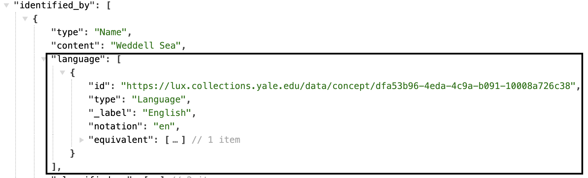

# Place

Places are one of the foundational classes in the model. Events and activities occur at a place, objects exist at some location, and people and organizations have associated locations where they reside or are otherwise associated with. Places are extents in space, independent of time or what may or may not be present in that space. For built works such as architecture and works that are fixed in location due to their media (a cave drawing for example), Place is a defining characteristic.

[Linked.art's Place Model Documentation](https://linked.art/model/place/)

### Representative Data Examples

- [New Haven](https://lux.collections.yale.edu/data/place/a5b17437-4725-48ec-8a9f-b014e3187b64)
- [Solar system](https://lux.collections.yale.edu/data/place/887b74cc-1a53-4640-95fb-29250a08b085)
- [Weddell Sea](https://lux.collections.yale.edu/data/place/e1f67149-d9c2-4610-8e84-84199e46c3b3)

 

### LUX Modeling Documentation

- [Names & Identifiers](#names-and-identifiers)
- [Classification](#classification)
- [Defined By](#defined-by)
- [Statement](#statement)
- [Member Of](#member-of)

### Names and Identifiers

| LUX Field Name | LUX Description | LUX Path |
| -------------- | --------------- | -------- |
| Name | Name of Place | identified_by > Name > content |

**JSON Example**

---

| LUX Field Name | LUX Description | LUX Path |
| -------------- | --------------- | -------- |
| Name Type | The classification of the name, e.g. "primary". | identified_by > Name > classified_as |

**JSON Example**

---

| LUX Field Name | LUX Description | LUX Path |
| -------------- | --------------- | -------- |
| Name Language | The language of the name, e.g. "English". | identified_by > Name > language |

**JSON Example**

---

| LUX Field Name | LUX Description | LUX Path |
| -------------- | --------------- | -------- |
| Exact Match | Holds internal URI or reconciled URI.  | equivalent |

**JSON Example**

---

| LUX Field Name | LUX Description | LUX Path |
| -------------- | --------------- | -------- |
| Internal Label | Human-readable label for Place. | _label |

**JSON Example**

### Classification

| LUX Field Name | LUX Description | LUX Path |
| -------------- | --------------- | -------- |
| Type | Classification of the Place, e.g. "city". | classified_as |

**JSON Example**

### Defined By

| LUX Field Name | LUX Description | LUX Path |
| -------------- | --------------- | -------- |
| Defined By | Used to store WKT (well known text) coordinates for polygon (map bounding box) or point for documented Place. | defined_by |

**JSON Example**

### Statement

| LUX Field Name | LUX Description | LUX Path |
| -------------- | --------------- | -------- |
| Statement | Statement about the Place. | referred_to_by > content |

**JSON Example**

---

| LUX Field Name | LUX Description | LUX Path |
| -------------- | --------------- | -------- |
| Statement Type | Classification of the statement about the Place, e.g. "description". | referred_to_by > classified_as |

**JSON Example**

---

| LUX Field Name | LUX Description | LUX Path |
| -------------- | --------------- | -------- |
| Statement Language | Language of the statement about the Place, e.g. "english". | referred_to_by > language |

**JSON Example**

### Member Of

| LUX Field Name | LUX Description | LUX Path |
| -------------- | --------------- | -------- |
| Member of Set | Set this Place is a member of. | member_of |

**JSON Example**
example pending

---

| LUX Field Name | LUX Description | LUX Path |
| -------------- | --------------- | -------- |
| Part Of | Used to document what Places this Place is a part of, e.g. New York City is a part of New York State. | part_of |

**JSON Example**

### Digital Images

| LUX Field Name | LUX Description | LUX Path |
| -------------- | --------------- | -------- |
| Depicting Image | Images of Places are suppressed in the UI in favor of map tiles, but there may still be data here from Wikimedia reconciliation. | representation |

**JSON Example**
example pending

---

| LUX Field Name | LUX Description | LUX Path |
| -------------- | --------------- | -------- |
| Digital Reference | Webpages and IIIF manifests. | subject_of > digitally_carried_by |

**JSON Example**

---

| LUX Field Name | LUX Description | LUX Path |
| -------------- | --------------- | -------- |
| Digital Reference Type | Classification of digital reference. | subject_of > digitally_carried_by > classified_as |

**JSON Example**

---

| LUX Field Name | LUX Description | LUX Path |
| -------------- | --------------- | -------- |
| Name for Digital Reference | Label for the digital reference. | subject_of > digitally_carried_by > identified_by |

**JSON Example**
example pending

---

| LUX Field Name | LUX Description | LUX Path |
| -------------- | --------------- | -------- |
| Digital Reference Format | Media type of digital object (e.g. "text/html"). | subject_of > digitally_carried_by > format |

**JSON Example**
example pending

---

| LUX Field Name | LUX Description | LUX Path |
| -------------- | --------------- | -------- |
| Digital Reference Access Point | The ID field in this array is used to store the website URL, for example, "https://nyc.gov". | subject_of > digitally_carried_by > access_point |

**JSON Example**

