# Set

Sets are conceptual groupings, rather than physical ones. The set of objects in a virtual exhibition or simply the set of a person's favorite objects never change their physical state by being part of the Set or not. One might have a set of destroyed objects which would be extremely strange if the Set was a physical aggregation of things which no longer existed. Sets are, thus, created by a Creation, not by a Production, and cannot be destroyed. A set may have zero members at any given point in time without going out of existence.

See more at:
[Linked.art's Set Model Documentation](https://linked.art/model/collection/)

### Representative Data Examples

- [Walt Whitman Archive](https://lux.collections.yale.edu/data/set/a3f4696e-e8a2-41a4-9fd0-69354c8430bd)
- [Vale Zines Collection](https://lux.collections.yale.edu/data/set/97b3fb68-cfd8-4133-b19b-680a25a755ab)
- [European Art Collection, Yale University Art Gallery](https://lux.collections.yale.edu/data/set/97b3fb68-cfd8-4133-b19b-680a25a755ab)

 

### LUX Modeling Documentation

- [Names & Identifiers](#names-and-identifiers)
- [Classification](#classification)
- [Creation](#creation)
- [Statement](#statement)
- [Member Of](#member-of)
- [Members Exemplified By](#members-exemplified-by)
- [Digital Reference](#digital-reference)

### Names and Identifiers

| LUX Field Name | LUX Description | LUX Path |
| -------------- | --------------- | -------- |
| Name | Name of Set | identified_by > Name > content |

**JSON Example**
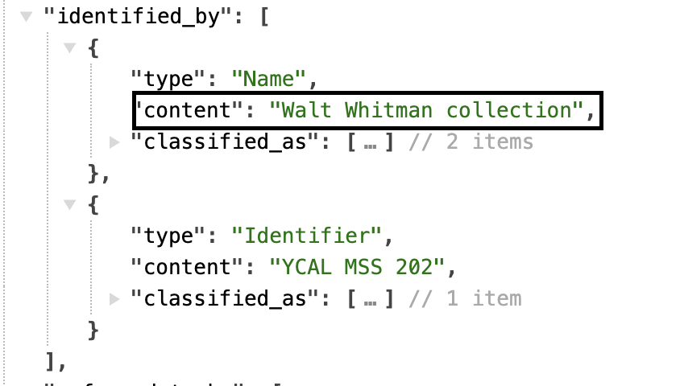

---

| LUX Field Name | LUX Description | LUX Path |
| -------------- | --------------- | -------- |
| Name Type | The classification of the name, e.g. "primary". | identified_by > Name > classified_as |

**JSON Example**
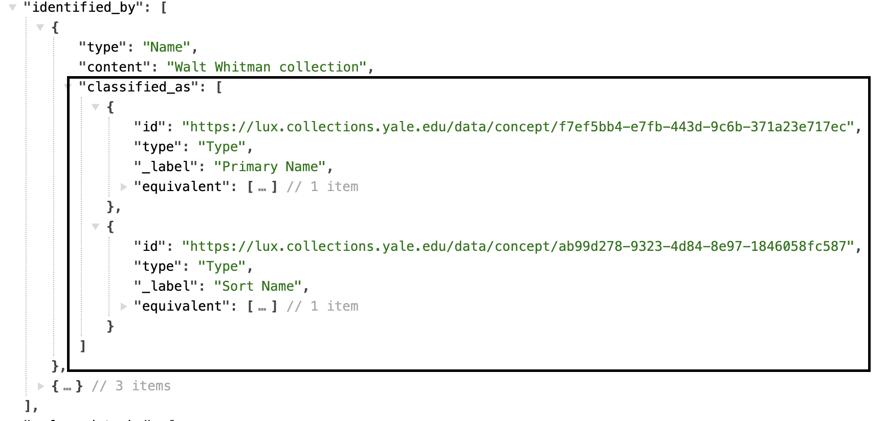

---

| LUX Field Name | LUX Description | LUX Path |
| -------------- | --------------- | -------- |
| Name Language | The language of the name, e.g. "English". | identified_by > Name > language |

**JSON Example**
example pending

---

| LUX Field Name | LUX Description | LUX Path |
| -------------- | --------------- | -------- |
| Identifier  | Numerical identifiers for the Set. | identified_by > Identifier > content |

**JSON Example**
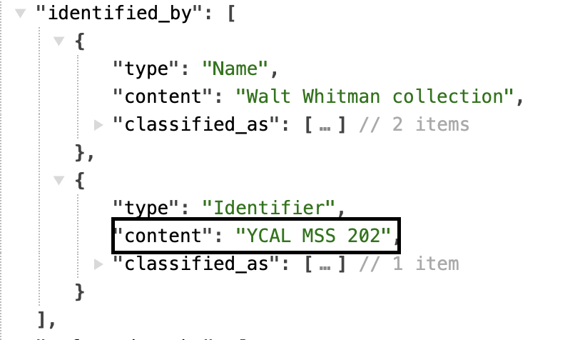

---

| LUX Field Name | LUX Description | LUX Path |
| -------------- | --------------- | -------- |
| Identifier Type | Classification of numerical identifiers. | identified_by > Identifier > classified_as   |

**JSON Example**
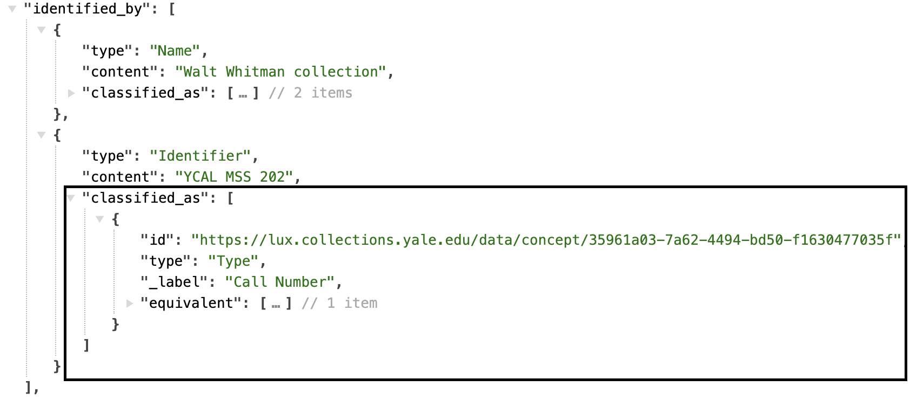

---

| LUX Field Name | LUX Description | LUX Path |
| -------------- | --------------- | -------- |
| Identifier Data Assignment | Used to denote the assigner of the identifier. In archival Sets, this is used to structure the hierarchy of the finding aid. | identified_by > Identifier > assigned_by > AttributeAssignment |

**JSON Example**
example pending

---

| LUX Field Name | LUX Description | LUX Path |
| -------------- | --------------- | -------- |
| Exact Match | On Sets, the equivalent property usually only holds the record of internal unit's URI that contributes to the LUX record. | equivalent |

**JSON Example**
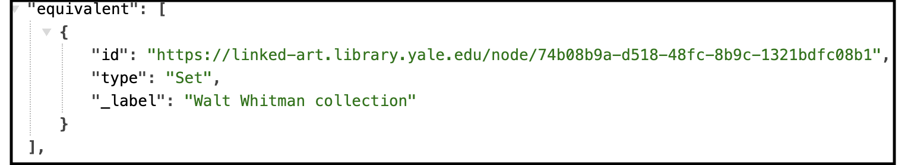

---

| LUX Field Name | LUX Description | LUX Path |
| -------------- | --------------- | -------- |
| Internal Label | Human-readable label for Set. | _label |

**JSON Example**

### Classification

| LUX Field Name | LUX Description | LUX Path |
| -------------- | --------------- | -------- |
| Type | Classification of the Set. | classified_as |

**JSON Example**
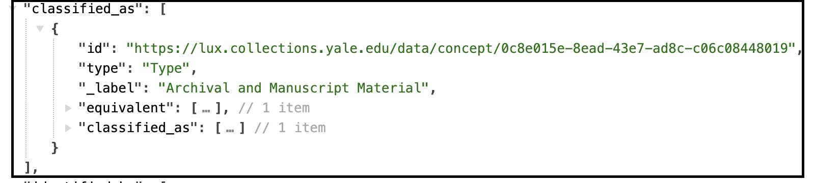

### Creation

| LUX Field Name | LUX Description | LUX Path |
| -------------- | --------------- | -------- |
| Creator in Creation Event | Creator of Set. | created_by > carried_out_by |

**JSON Example**
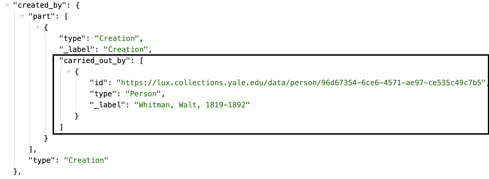

---

| LUX Field Name | LUX Description | LUX Path |
| -------------- | --------------- | -------- |
| Location of Creation Event | Location of creation. | created_by > took_place_at |

**JSON Example**
example pending

---

| LUX Field Name | LUX Description | LUX Path |
| -------------- | --------------- | -------- |
| Creation Event Type | Classification of the creation. | created_by > classified_as |

**JSON Example**
example pending

---

| LUX Field Name | LUX Description | LUX Path |
| -------------- | --------------- | -------- |
| TimeSpan of Creation Event | Timespan of creation. | created_by > timespan |

**JSON Example**
example pending

---

| LUX Field Name | LUX Description | LUX Path |
| -------------- | --------------- | -------- |
| Statement about Creation Event | Statements about the Creation. | created_by > referred_to_by |

**JSON Example**
example pending

### Statement

| LUX Field Name | LUX Description | LUX Path |
| -------------- | --------------- | -------- |
| Statement | Statement about the Set. | referred_to_by > content |

**JSON Example**
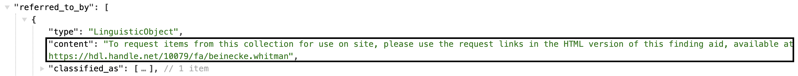

---

| LUX Field Name | LUX Description | LUX Path |
| -------------- | --------------- | -------- |
| Statement Type | Classification of the statement about the Set. | referred_to_by > classified_as |

**JSON Example**
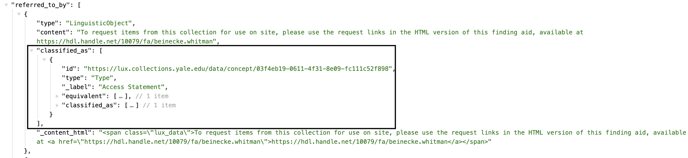

---

| LUX Field Name | LUX Description | LUX Path |
| -------------- | --------------- | -------- |
| Statement Language | Language of the statement about the Set.| referred_to_by > language |

**JSON Example**
example pending

### Member Of

| LUX Field Name | LUX Description | LUX Path |
| -------------- | --------------- | -------- |
| Member of Set | Other Sets this Set is a member of. | member_of |

**JSON Example**
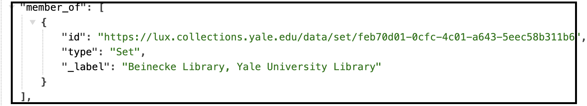

### Used For

| LUX Field Name | LUX Description | LUX Path |
| -------------- | --------------- | -------- |
| Used for Curation | Connects the Set to a curation activity, carried out by the Group responsible for the collection | used_for |

**JSON Example**
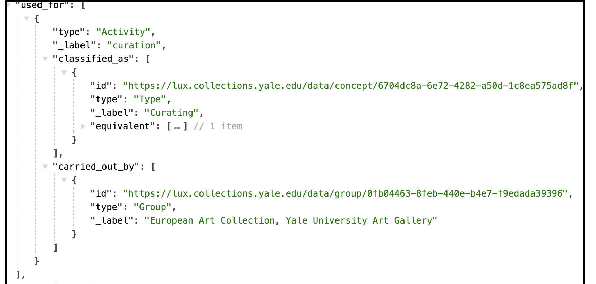

### Members Exemplified By

| LUX Field Name | LUX Description | LUX Path |
| -------------- | --------------- | -------- |
| Members Exemplified By | The information about any particular member of a set might not be available, however general information might be known about the entities that are members of the set. The description of prototype member is embedded within the Set here. | members_exemplified_by |

**JSON Example**
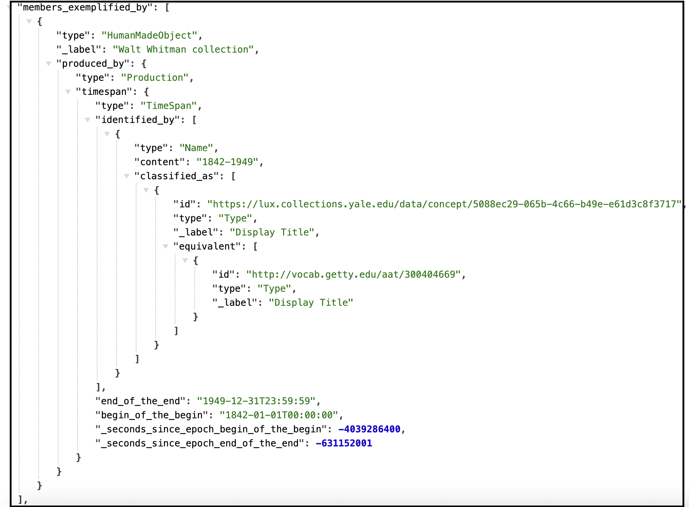

### Digital Reference

| LUX Field Name | LUX Description | LUX Path |
| -------------- | --------------- | -------- |
| Digital Reference | Webpages and IIIF manifests. On Sets, this is usually used to direct users to the home page or Archives at Yale page for the item. | subject_of > digitally_carried_by |

**JSON Example**
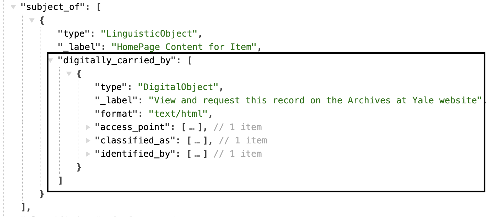

---

| LUX Field Name | LUX Description | LUX Path |
| -------------- | --------------- | -------- |
| Digital Reference Type | Classification of digital reference. | subject_of > digitally_carried_by > classified_as |

**JSON Example**
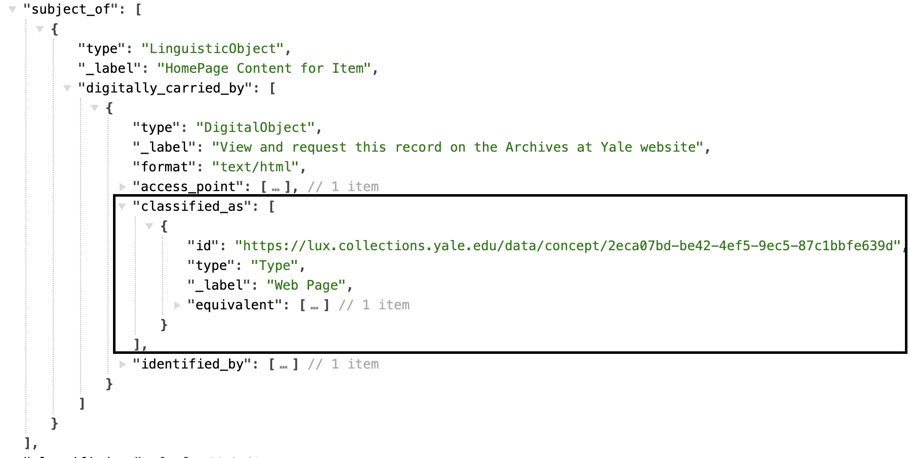

---

| LUX Field Name | LUX Description | LUX Path |
| -------------- | --------------- | -------- |
| Name for Digital Reference | Label for the digital reference. | subject_of > digitally_carried_by > identified_by |

**JSON Example**
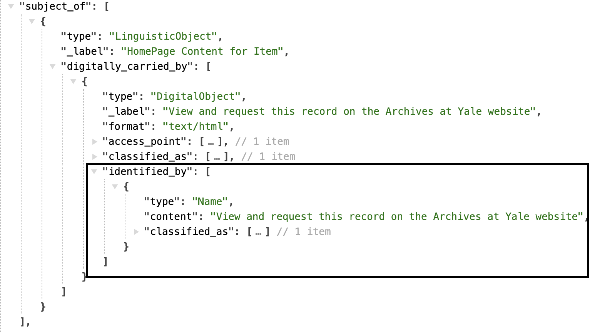

---

| LUX Field Name | LUX Description | LUX Path |
| -------------- | --------------- | -------- |
| Digital Reference Format | Media type of digital object (e.g. "text/html"). | subject_of > digitally_carried_by > format |

**JSON Example**
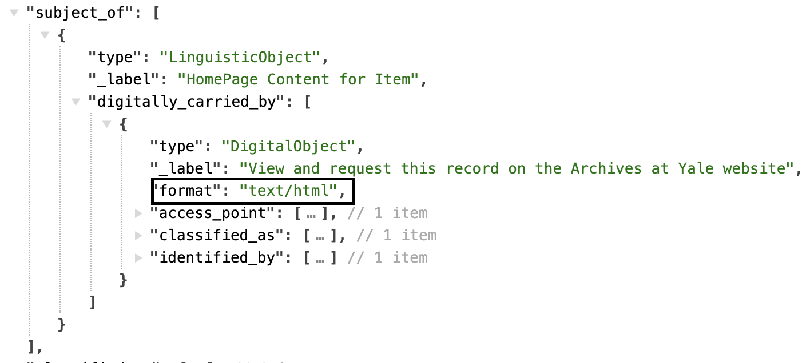

---

| LUX Field Name | LUX Description | LUX Path |
| -------------- | --------------- | -------- |
| Digital Reference Access Point | The ID field in this array is used to store the website URL. | subject_of > digitally_carried_by > access_point |

**JSON Example**
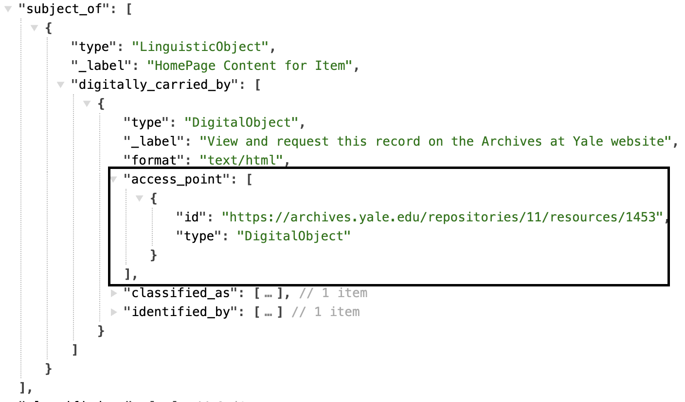

