# Textual Work

This section documents the model for documents that contain text, including artworks such as medieval manuscripts, archival material such as letters, ledgers or diaries, scholarly communication such as journals, articles and monographs, digital objects such as web pages, or any other sort of written communication.

[Linked.art's Textual Work Model Documentation](https://linked.art/model/document/)

### Representative Data Examples

- [Voynich Manuscript](https://lux.collections.yale.edu/data/text/7ef864d8-076a-4c6c-b931-819cb2f9f3c1)
- [1 maia—prazdnik mira i truda](https://lux.collections.yale.edu/data/text/2c41f1f0-5bd6-42be-8c27-780c37298a9b)
- [The tragicall historie of Hamlet, Prince of Denmarke](https://lux.collections.yale.edu/data/text/20d27ee5-4a8b-47e4-a905-0977fcb9d943)
- [Engishiki](https://lux.collections.yale.edu/data/text/9dee6b0d-7176-4351-b26a-79f23b79555c)
- [Here in thys boke afore...](https://lux.collections.yale.edu/data/text/654c51b6-c1f3-4459-8b38-b73ca79f5243)

### LUX Modeling Documentation

- [Names & Identifiers](#names-and-identifiers)
- [Classification](#classification)
- [Creation](#creation)
- [Publication](#publication)
- [Statement](#statement)
- [Part Of](#part-of)
- [About](#about)
- [Rights](#rights)
- [Digital Reference](#digital-reference)

### Names and Identifiers

| LUX Field Name | LUX Description | LUX Path |
| -------------- | --------------- | -------- |
| Name | Used to document the name of the Textual Work, usually the same as the Human Made Object. | identified_by > Name > content |

**JSON Example**
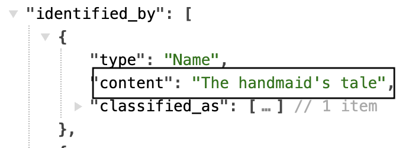

---

| LUX Field Name | LUX Description | LUX Path |
| -------------- | --------------- | -------- |
| Name Type | The classification of the name, e.g. "primary" or "sort". | identified_by > Name > classified_as |

**JSON Example**
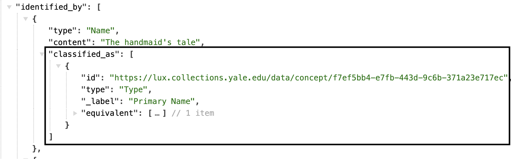

---

| LUX Field Name | LUX Description | LUX Path |
| -------------- | --------------- | -------- |
| Name Language | The language of the name, e.g. "English". | identified_by > Name > language |

**JSON Example**
example pending

---

| LUX Field Name | LUX Description | LUX Path |
| -------------- | --------------- | -------- |
| Identifier  | Numerical identifiers for the Textual Work, e.g. the ILS YUL number. | identified_by > Identifier > content |

**JSON Example**
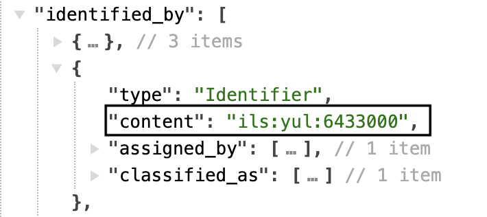

---

| LUX Field Name | LUX Description | LUX Path |
| -------------- | --------------- | -------- |
| Identifier Type | Classification of numerical identifiers. | identified_by > Identifier > classified_as   |

**JSON Example**
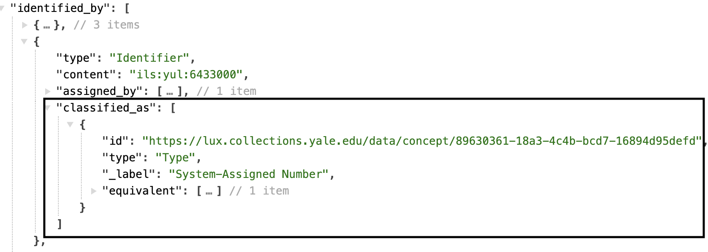

---

| LUX Field Name | LUX Description | LUX Path |
| -------------- | --------------- | -------- |
| Identifier Data Assignment | Used to denote the assigner of the identifier.  | identified_by > Identifier > assigned_by > AttributeAssignment |

**JSON Example**
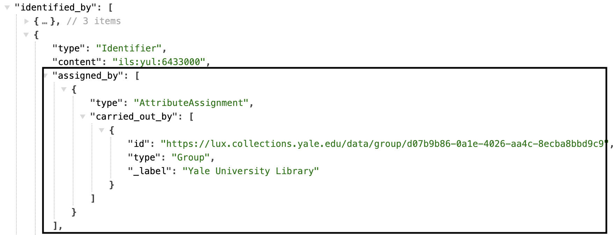

---

| LUX Field Name | LUX Description | LUX Path |
| -------------- | --------------- | -------- |
| Exact Match | On Textual Works, the equivalent property usually holds the record of internal unit's URI that contributes to the LUX record. It may also include a Wikidata URI, if this Textual Work was reconciled to Wikidata. | equivalent |

**JSON Example**
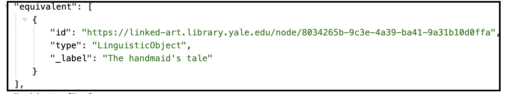

---

| LUX Field Name | LUX Description | LUX Path |
| -------------- | --------------- | -------- |
| Internal Label | Human-readable label for work. | _label |

**JSON Example**
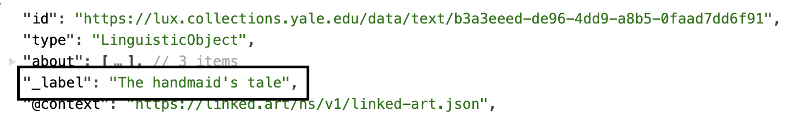

### Classification

| LUX Field Name | LUX Description | LUX Path |
| -------------- | --------------- | -------- |
| Type | Classification of the Textual Work, e.g. "poetry"| classified_as |

**JSON Example**
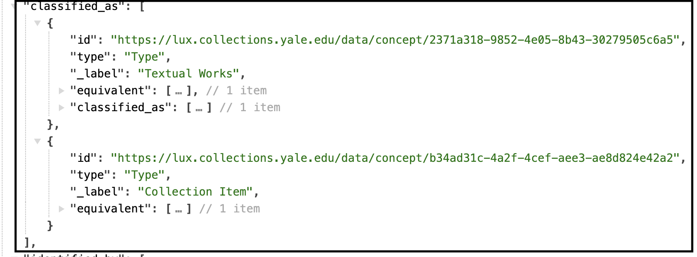

### Creation

| LUX Field Name | LUX Description | LUX Path |
| -------------- | --------------- | -------- |
| Creator in Creation Event | Creator of Textual Work. Often, but not always, the same as the production location of the Human Made Object. | created_by > carried_out_by |

**JSON Example**
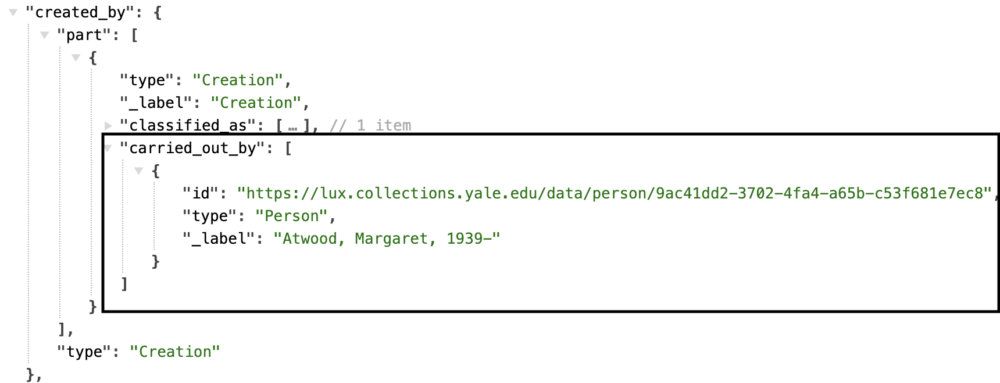

---

| LUX Field Name | LUX Description | LUX Path |
| -------------- | --------------- | -------- |
| Location of Creation Event | Location of creation. Often, but not always, the same as the production location of the Human Made Object. | created_by > took_place_at |

**JSON Example**
example pending

---

| LUX Field Name | LUX Description | LUX Path |
| -------------- | --------------- | -------- |
| Creation Event Type | Classification of the creation. | created_by > classified_as |

**JSON Example**
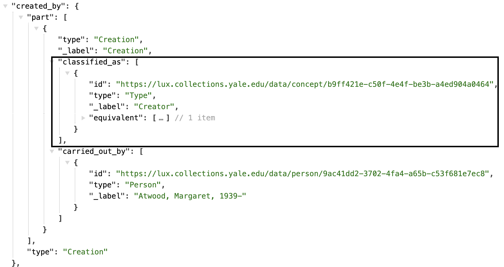

---

| LUX Field Name | LUX Description | LUX Path |
| -------------- | --------------- | -------- |
| TimeSpan of Creation Event | Timespan of creation. | created_by > timespan |

**JSON Example**
example pending

---

| LUX Field Name | LUX Description | LUX Path |
| -------------- | --------------- | -------- |
| Statement about Creation Event | Statements about the Creation. | created_by > referred_to_by |

**JSON Example**
example pending

---

| LUX Field Name | LUX Description | LUX Path |
| -------------- | --------------- | -------- |
| Cause of Creation Event | If an Activity with a separate record and URI is the cause of a Work's creation, this is where you can document that relationship. | created_by > caused_by |

**JSON Example**
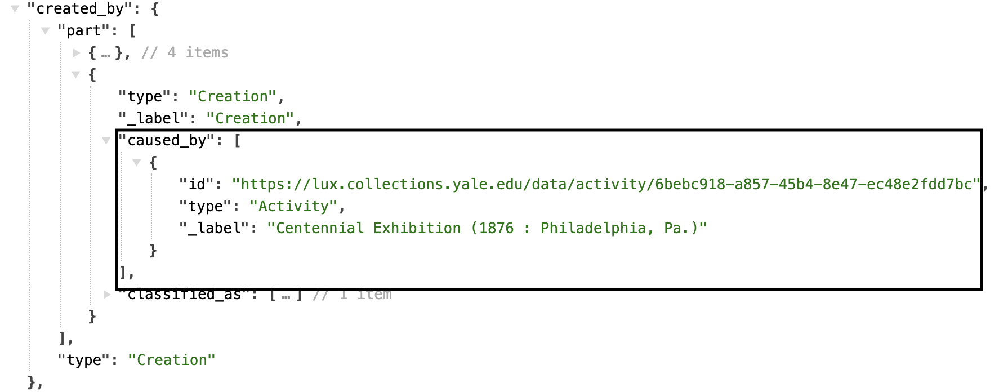

### Publication

| LUX Field Name | LUX Description | LUX Path |
| -------------- | --------------- | -------- |
| Actor in Publishing Activity | Publisher of Textual Work. | used_for > carried_out_by |

**JSON Example**
example pending

---

| LUX Field Name | LUX Description | LUX Path |
| -------------- | --------------- | -------- |
| Location of Publication | Location of publication. | used_for > took_place_at |

**JSON Example**
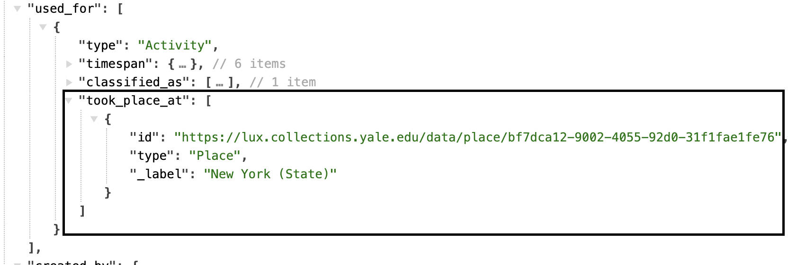

---

| LUX Field Name | LUX Description | LUX Path |
| -------------- | --------------- | -------- |
| Publication Type | Classification of the publication, usually "publishing". | used_for > classified_as |

**JSON Example**
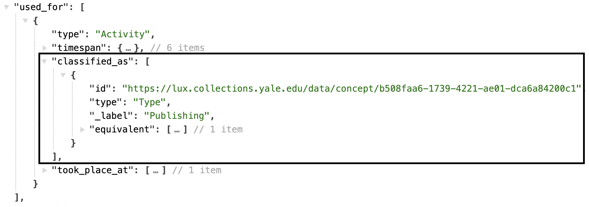

---

| LUX Field Name | LUX Description | LUX Path |
| -------------- | --------------- | -------- |
| TimeSpan of Publication | Timespan of publication. | used_for > timespan |

**JSON Example**
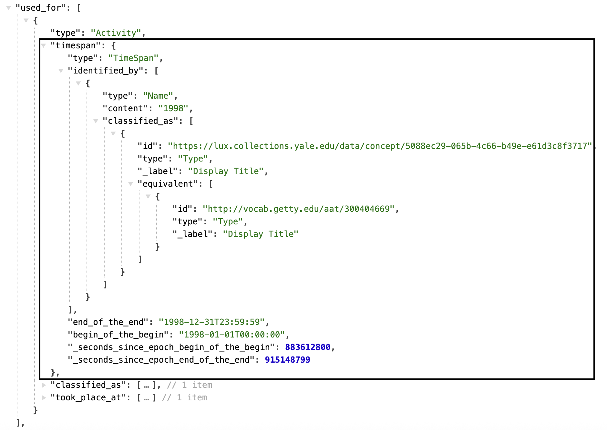

---

| LUX Field Name | LUX Description | LUX Path |
| -------------- | --------------- | -------- |
| Statement about Publication | Statements about the Publication. | used_for > referred_to_by |

**JSON Example**
example pending

### Statement

| LUX Field Name | LUX Description | LUX Path |
| -------------- | --------------- | -------- |
| Statement | Statements about the Textual Work. | referred_to_by > content |

**JSON Example**
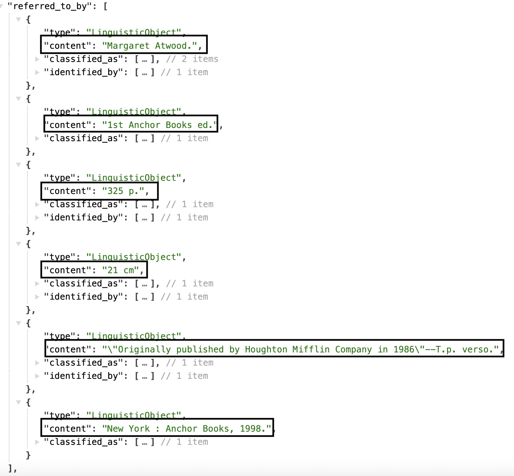

---

| LUX Field Name | LUX Description | LUX Path |
| -------------- | --------------- | -------- |
| Statement Type | Classification of the statement, e.g. "edition statement". | referred_to_by > classified_as |

**JSON Example**
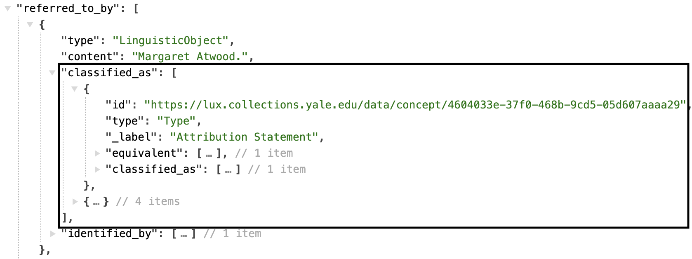

---

| LUX Field Name | LUX Description | LUX Path |
| -------------- | --------------- | -------- |
| Statement Language | Language of statement.| referred_to_by > language |

**JSON Example**
example pending

---

| LUX Field Name | LUX Description | LUX Path |
| -------------- | --------------- | -------- |
| Name for Statement | In LUX, units can leverage this field to push a specific label for statements on a Work. For example, if the classification label is not your preferred label, you can use a string label in the content of the statement name and the front end will display this as the statement label. | referred_to_by > identified_by |

**JSON Example**
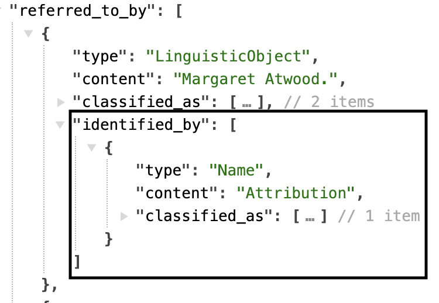

### Part Of

| LUX Field Name | LUX Description | LUX Path |
| -------------- | --------------- | -------- |
| Part of Work | Used to link the documented Textual Work to the overall Textual Work it is a part of. | part_of |

**JSON Example**
example pending

---

| LUX Field Name | LUX Description | LUX Path |
| -------------- | --------------- | -------- |
| Part of Set | This does not currently exist in LUX data, but may in the future. Potential use cases: If users add Textual Works to their My Collection; if units have Set information about their Textual Works | member_of |

**JSON Example**
example pending

### About

| LUX Field Name | LUX Description | LUX Path |
| -------------- | --------------- | -------- |
| About | Used to link the Textual Work to any entity of any Class that it is about, e.g. themes or topics. | about |

**JSON Example**
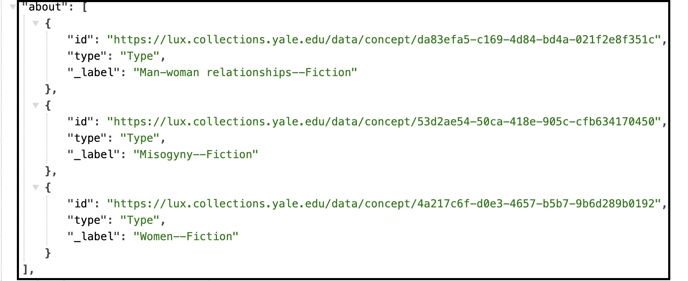

---

| LUX Field Name | LUX Description | LUX Path |
| -------------- | --------------- | -------- |
| Language| Language of the documented Textual Work, if known. | language |

**JSON Example**
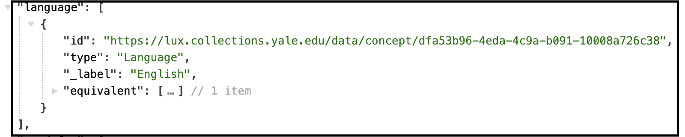

### Rights

| LUX Field Name | LUX Description | LUX Path |
| -------------- | --------------- | -------- |
| Subject To | Used to hold rights information on the Textual Work.| subject_to |

**JSON Example**
example pending

---

| LUX Field Name | LUX Description | LUX Path |
| -------------- | --------------- | -------- |
| Subject To Classification| The classification of the rights information. In LUX, the id property of this array is used to hold a link to the, e.g. rightsstatements URL. | subject_to > classified_as |

**JSON Example**
example pending

---

| LUX Field Name | LUX Description | LUX Path |
| -------------- | --------------- | -------- |
| Subject To Name| The name of the rights information that appears as a label for the URL in the UI, e.g. "In Copyright". | subject_to > identified_by|

**JSON Example**
example pending

### Digital Reference

| LUX Field Name | LUX Description | LUX Path |
| -------------- | --------------- | -------- |
| Depicting Image | For LUX, this is only used on Textual Works if there is not already a IIIF manifest (which is stored in the subject_of property). You will find representation most often on subject heading records vended by the Library that are Works and are reconciled to Wikidata. LUX pipeline will add Wikimedia images to these via this property.| representation |

**JSON Example**
example pending 

---

| LUX Field Name | LUX Description | LUX Path |
| -------------- | --------------- | -------- |
| Digital Reference | Webpages and IIIF manifests. | subject_of > digitally_carried_by |

**JSON Example**
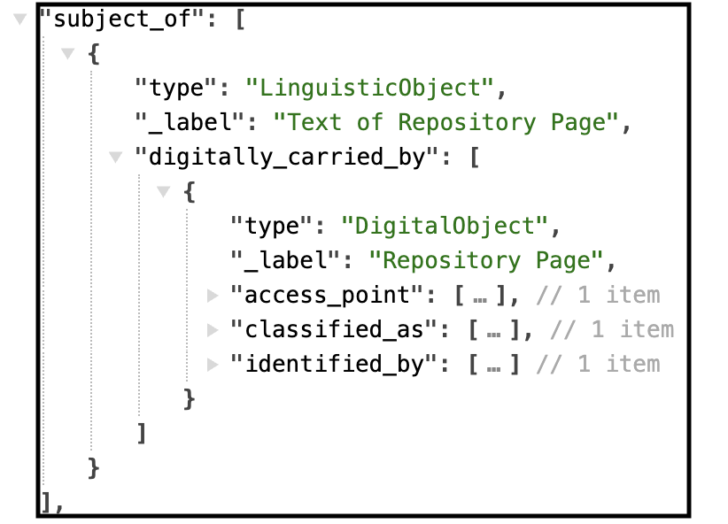

---

| LUX Field Name | LUX Description | LUX Path |
| -------------- | --------------- | -------- |
| Digital Reference Type | Classification of digital reference. | subject_of > digitally_carried_by > classified_as |

**JSON Example**
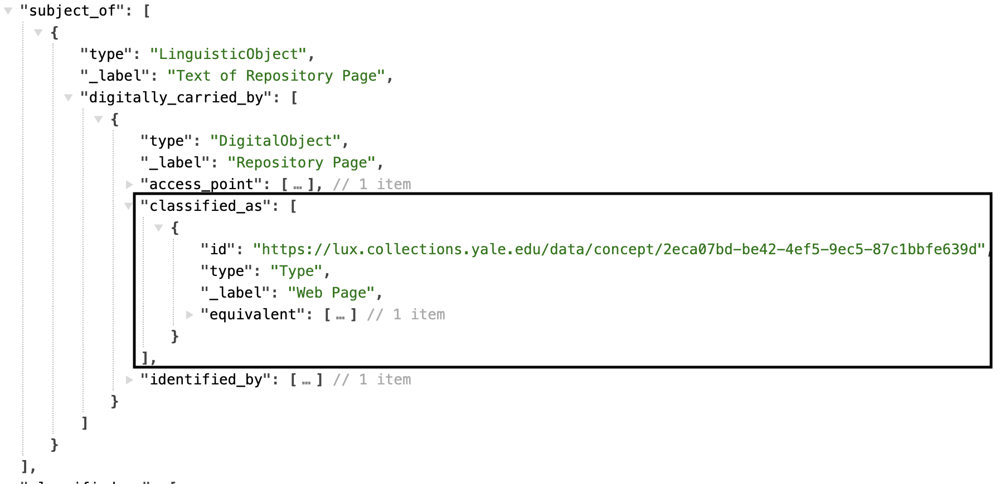

---

| LUX Field Name | LUX Description | LUX Path |
| -------------- | --------------- | -------- |
| Name for Digital Reference | Label for the digital reference. | subject_of > digitally_carried_by > identified_by |

**JSON Example**
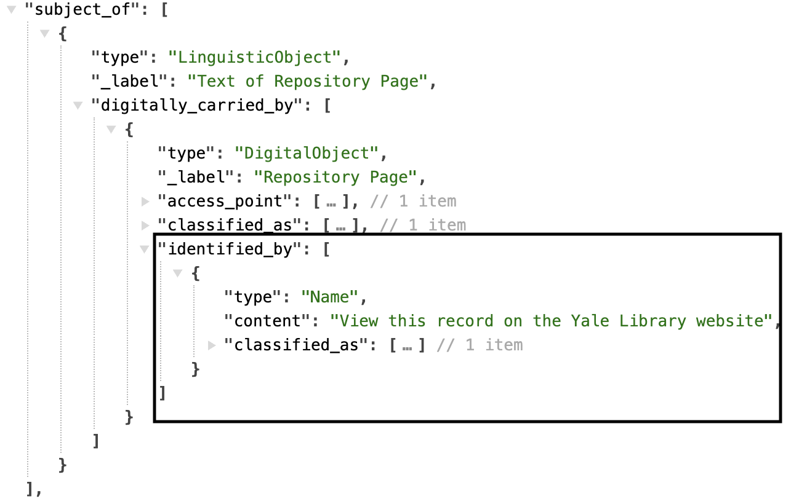

---

| LUX Field Name | LUX Description | LUX Path |
| -------------- | --------------- | -------- |
| Digital Reference Format | Media type of digital object (e.g. "text/html"). | subject_of > digitally_carried_by > format |

**JSON Example**

---

| LUX Field Name | LUX Description | LUX Path |
| -------------- | --------------- | -------- |
| Digital Reference Access Point | Website URL or URI of digital object. | subject_of > digitally_carried_by > access_point |

**JSON Example**
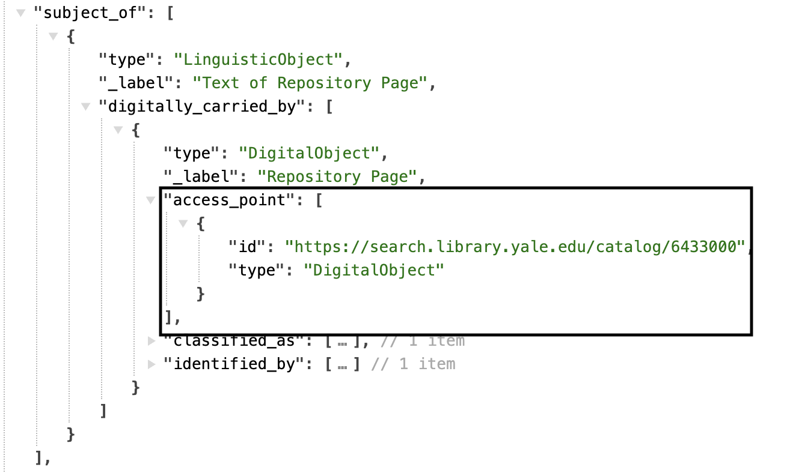
