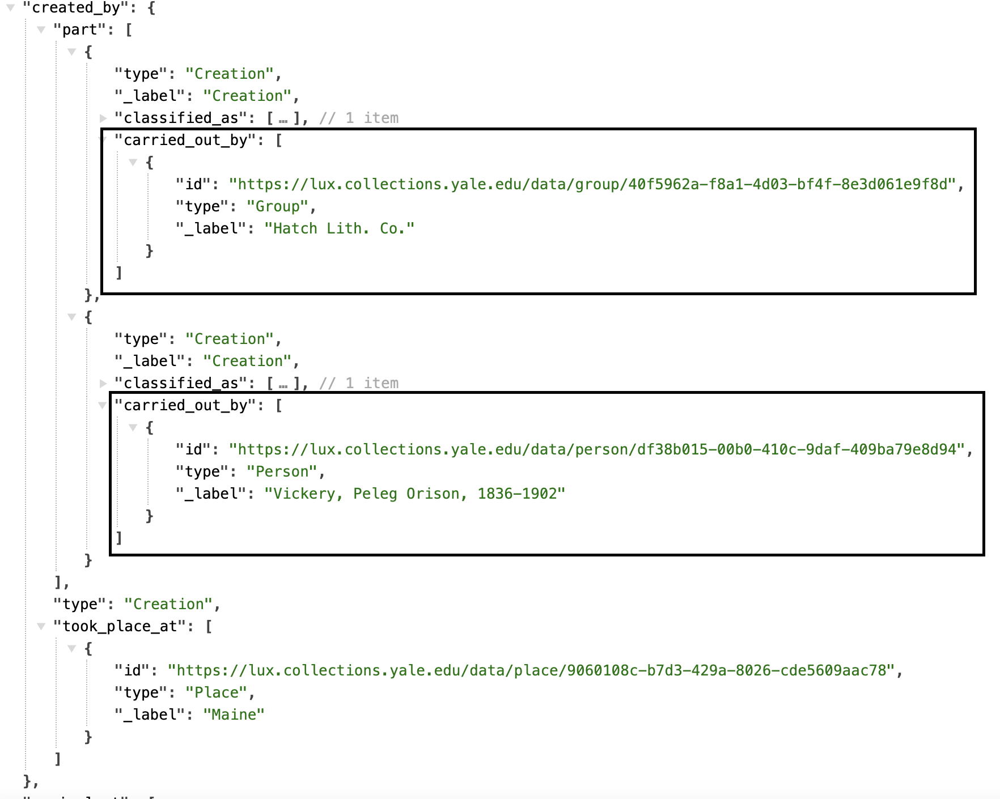

# Visual Work

Every human-made object with an intent to look a certain way is the carrier of a visual work, and could be a primarily two dimensional artwork such as a painting, a three dimensional artwork such as a statue, or a crafted three dimensional object such as armor, a plate, or a building.

This visual work is modeled as a VisualItem resource, associated with the HumanMadeObject instances via the shows property. The VisualItem then has various properties described below that are used to describe the different facets.

[Linked.art's Visual Work Model Documentation](https://linked.art/model/object/aboutness/)

### Representative Data Examples

- [One dollar private bank note issued by the Bank of Augusta](https://lux.collections.yale.edu/data/visual/8f560208-30ec-4414-98e7-42a467e8c90c)
- [Dort or Dordrecht: The Packetboat from Rotterdam Becalmed](https://lux.collections.yale.edu/data/visual/51e142d8-799a-4178-8706-4435253a355c)
- [Photographic views of Kern County California](https://lux.collections.yale.edu/data/visual/f46be110-ce33-47c6-8fae-c1e7143afd5a)
- [1 maia—prazdnik mira i truda](https://lux.collections.yale.edu/data/visual/c35629f2-b067-40e6-8606-81eb45688837)

### LUX Modeling Documentation

- [Names & Identifiers](#names-and-identifiers)
- [Classification](#classification)
- [Creation](#creation)
- [Publication](#publication)
- [Statement](#statement)
- [Part Of](#part-of)
- [About](#about)
- [Rights](#rights)
- [Digital Reference](#digital-reference)

### Names and Identifiers

| LUX Field Name | LUX Description | LUX Path |
| -------------- | --------------- | -------- |
| Name | The name for the Visual Work, usually the same as the name for the Human Made Object. | identified_by > Name > content |

**JSON Example**

---

| LUX Field Name | LUX Description | LUX Path |
| -------------- | --------------- | -------- |
| Name Type | The classification of the name, e.g. "primary" or "sort". | identified_by > Name > classified_as |

**JSON Example**

---

| LUX Field Name | LUX Description | LUX Path |
| -------------- | --------------- | -------- |
| Name Language | The language of the name, e.g. "English". | identified_by > Name > language |

**JSON Example**
example pending

---

| LUX Field Name | LUX Description | LUX Path |
| -------------- | --------------- | -------- |
| Exact Match | On Visual Works, the equivalent property usually only holds the record of internal unit's URI that contributes to the LUX record.  | equivalent |

**JSON Example**

---

| LUX Field Name | LUX Description | LUX Path |
| -------------- | --------------- | -------- |
| Internal Label | Human-readable label for work. | _label |

**JSON Example**

### Classification

| LUX Field Name | LUX Description | LUX Path |
| -------------- | --------------- | -------- |
| Type | Classification for Visual Work, e.g. "landscape". | classified_as |

**JSON Example**

### Creation

| LUX Field Name | LUX Description | LUX Path |
| -------------- | --------------- | -------- |
| Creator in Creation Event | Creator of Visual Work. Often, but not always, the same as the producer of the Human Made Object. May be nested in `part`. | created_by > carried_out_by |

**JSON Example**

---

| LUX Field Name | LUX Description | LUX Path |
| -------------- | --------------- | -------- |
| Location of Creation Event | Location of creation. Often, but not always, the same as the production location of the Human Made Object. | created_by > took_place_at |

**JSON Example**

---

| LUX Field Name | LUX Description | LUX Path |
| -------------- | --------------- | -------- |
| Creation Event Type | Classification of the creation. | created_by > classified_as |

**JSON Example**

---

| LUX Field Name | LUX Description | LUX Path |
| -------------- | --------------- | -------- |
| TimeSpan of Creation Event | Timespan of creation. | created_by > timespan |

**JSON Example**
example pending

---

| LUX Field Name | LUX Description | LUX Path |
| -------------- | --------------- | -------- |
| Statement about Creation Event | Statements about the Creation. | created_by > referred_to_by |

**JSON Example**
example pending

### Publication

| LUX Field Name | LUX Description | LUX Path |
| -------------- | --------------- | -------- |
| Actor in Publishing Activity | Publisher of Visual Work. | used_for > carried_out_by |

**JSON Example**
example pending

---

| LUX Field Name | LUX Description | LUX Path |
| -------------- | --------------- | -------- |
| Location of Publication | Location of publication. | used_for > took_place_at |

**JSON Example**

---

| LUX Field Name | LUX Description | LUX Path |
| -------------- | --------------- | -------- |
| Publication Type | Classification of the publication, usually "publishing". | used_for > classified_as |

**JSON Example**

---

| LUX Field Name | LUX Description | LUX Path |
| -------------- | --------------- | -------- |
| TimeSpan of Publication | Timespan of publication. | used_for > timespan |

**JSON Example**
example pending

---

| LUX Field Name | LUX Description | LUX Path |
| -------------- | --------------- | -------- |
| Statement about Publication | Statements about the Publication. | used_for > referred_to_by |

**JSON Example**
example pending

### Statement

| LUX Field Name | LUX Description | LUX Path |
| -------------- | --------------- | -------- |
| Statement | Statement about the Visual Work. | referred_to_by > content |

**JSON Example**

---

| LUX Field Name | LUX Description | LUX Path |
| -------------- | --------------- | -------- |
| Statement Type | Classification of the statement. | referred_to_by > classified_as |

**JSON Example**

---

| LUX Field Name | LUX Description | LUX Path |
| -------------- | --------------- | -------- |
| Statement Language | Language of statement.| referred_to_by > language |

**JSON Example**
example pending

---

| LUX Field Name | LUX Description | LUX Path |
| -------------- | --------------- | -------- |
| Name for Statement | In LUX, units can leverage this field to push a specific label for statements on a Work. For example, if the classification label is not your preferred label, you can use a string label in the content of the statement name and the front end will display this as the statement label. | referred_to_by > identified_by |

**JSON Example**

### Part Of

| LUX Field Name | LUX Description | LUX Path |
| -------------- | --------------- | -------- |
| Part of Work | This does not currently exist in LUX data, but may in the future. Potential use case: A record for a Visual Work that is a part of a larger Visual Work. | part_of |

**JSON Example**
example pending

---

| LUX Field Name | LUX Description | LUX Path |
| -------------- | --------------- | -------- |
| Part of Set | This does not currently exist in LUX data, but may in the future. Two potential use cases: If users add Visual Works to their My Collection; if units have Set information about their Visual Works | member_of |

**JSON Example**
example pending

### About

| LUX Field Name | LUX Description | LUX Path |
| -------------- | --------------- | -------- |
| About | Used to link the Visual Work to any entity of any Class that it is about, e.g. themes or things not explictly depicted in the image. For things depicted in the image itself, use represents. | about |

**JSON Example**

---

| LUX Field Name | LUX Description | LUX Path |
| -------------- | --------------- | -------- |
| Represents| Used to link the Visual Work to any entity it represents, and which can be identified in the image. For themes or things not visible in the image itself, use about. | represents |

**JSON Example**

### Rights

| LUX Field Name | LUX Description | LUX Path |
| -------------- | --------------- | -------- |
| Subject To | Used to hold rights information on the Visual Work.| subject_to |

**JSON Example**

---

| LUX Field Name | LUX Description | LUX Path |
| -------------- | --------------- | -------- |
| Subject To Classification| The classification of the rights information. In LUX, the id property of this array is used to hold a link to the, e.g. rightsstatements URL. | subject_to > classified_as |

**JSON Example**

| LUX Field Name | LUX Description | LUX Path |
| -------------- | --------------- | -------- |
| Subject To Name| The name of the rights information that appears as a label for the URL in the UI, e.g. "In Copyright". | subject_to > identified_by|

**JSON Example**

### Digital Reference

| LUX Field Name | LUX Description | LUX Path |
| -------------- | --------------- | -------- |
| Depicting Image | Thumbnail representation of the image. | representation |

**JSON Example**

---

| LUX Field Name | LUX Description | LUX Path |
| -------------- | --------------- | -------- |
| Digital Reference | Webpages and IIIF manifests. | subject_of > digitally_carried_by |

**JSON Example**

---

| LUX Field Name | LUX Description | LUX Path |
| -------------- | --------------- | -------- |
| Digital Reference Type | Classification of digital reference. | subject_of > digitally_carried_by > classified_as |

**JSON Example**

---

| LUX Field Name | LUX Description | LUX Path |
| -------------- | --------------- | -------- |
| Name for Digital Reference | Label for the digital reference. | subject_of > digitally_carried_by > identified_by |

**JSON Example**

---

| LUX Field Name | LUX Description | LUX Path |
| -------------- | --------------- | -------- |
| Digital Reference Format | Media type of digital object (e.g. "text/html"). | subject_of > digitally_carried_by > format |

**JSON Example**

---

| LUX Field Name | LUX Description | LUX Path |
| -------------- | --------------- | -------- |
| Digital Reference Access Point | Website URL or URI of digital object. | subject_of > digitally_carried_by > access_point |

**JSON Example**

